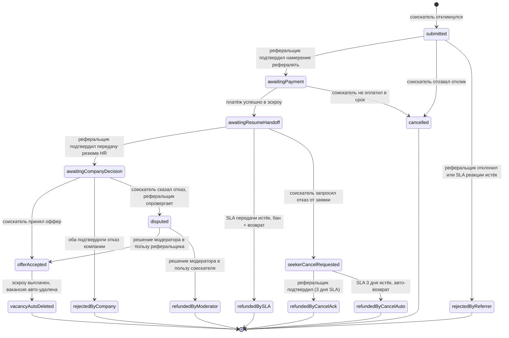
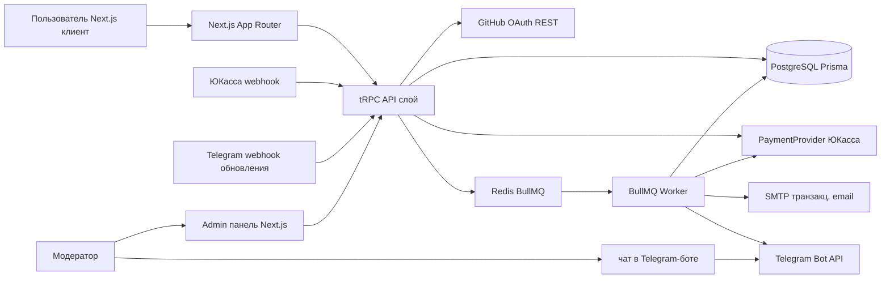
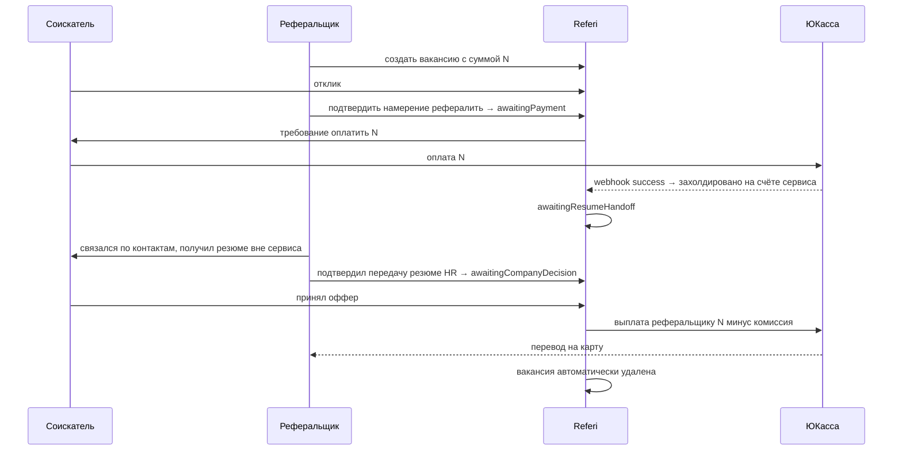

# Referi — PRD, техническая спецификация и план реализации

## Цель плана

Создать три артефакта в одном репозитории:
1. `docs/PRD.md` — продуктовые требования.
2. `spec/*.md` — набор технических спецификаций (AI-ready формат).
3. `docs/ROADMAP.md` + todo-декомпозиция в этом плане — последовательность реализации.

Код писать на следующем шаге, после подтверждения этих документов.

## Рекомендованный стек (мой выбор)

- **Фронтенд + бэкенд**: Next.js 15 App Router + TypeScript + tRPC (type-safe API внутри, REST при необходимости для вебхуков платёжки).
- **UI**: Tailwind CSS + shadcn/ui, русский интерфейс; адаптив; Lighthouse Accessibility ≥ 95.
- **БД**: PostgreSQL 16 + Prisma ORM. Денежные суммы — `BigInt` в копейках.
- **Auth**: Auth.js (NextAuth v5) с GitHub OAuth провайдером. Доп. проверка `created_at` через `GET /user` GitHub REST.
- **Платежи**: абстрактный `PaymentProvider` интерфейс + первая реализация — **ЮKassa** (платежи, холды, возвраты, выплаты на карту). Вебхук подтверждения в отдельном роуте с верификацией подписи.
- **Хранение документов**: сервис НЕ хранит резюме/файлы. Соискатель отправляет нужные документы реферальщику напрямую (мессенджер/почта) после того, как получил от того контакт. В БД хранятся только: контактная информация соискателя, краткая биография (≤ 1000 симв.), cover letter (≤ 300 симв., опционально).
- **Фоновые задачи**: BullMQ + Redis (SLA-таймеры, авто-возвраты, переводы денег по состояниям, регенерация попыток).
- **Уведомления**: SMTP (Mailgun/SendPulse абстракция) для транзакционных писем пользователям.
- **Канал жалоб/модерации**: Telegram-бот (создаётся пользователем вне рамок проекта). Пользователи жалуются и общаются с модераторами через бота; сервис шлёт модераторам уведомления о спорах в тот же бот.
- **Инфраструктура**: Docker Compose для dev, деплой — Railway/VPS + Postgres managed; регион РФ/дружественный (Яндекс Облако).
- **Тесты**: Vitest (unit), Playwright (e2e), тесты на state-machine через fast-check (property-based).

## Рекомендованные дефолты бизнес-правил (параметризуются в конфиге, обсуждаются в PRD)

### SLA
- Реакция реферальщика на новый отклик: **7 дней**.
- Оплата соискателем после `awaitingPayment`: **5 дней**.
- Передача резюме HR реферальщиком: **5 дней**.
- Подтверждение реферальщиком запроса соискателя на отказ от заявки: **3 дня** (после истечения — авто-возврат без подтверждения).
- Решение компании (с момента `awaitingCompanyDecision`): **30 дней** до авто-спора.

### Санкции
- Фриз вакансии за пропуск SLA реакции: **14 дней**.
- Бан реферальщика за не-передачу резюме в срок: **30 дней**.

### Лимиты (жёсткие, не расширяются подписками)
- Реферальщик: **1 активная вакансия** и **1 активное рассмотрение** одновременно. Подписки для реферальщика **нет**.
- Реферальщик: суммарный пул **3 попыток** на рассмотрение соискателей (глобальный счётчик пользователя, не per-vacancy).
  - При потере попытки (неудачное рассмотрение) счётчик НЕ восстанавливается сразу.
  - Каждая потерянная попытка автоматически регенерируется через **60 дней** от момента её потери.
  - Создание новой вакансии НЕ сбрасывает и НЕ пополняет счётчик.
  - При 0 попыток реферальщик не может брать новых соискателей в рассмотрение (вакансия остаётся, но новые подтверждения намерения рефералить запрещены).
- Соискатель: **2 активных отклика** бесплатно, расширяется подпиской или разовой покупкой отклика.

### Жизненный цикл вакансии
- При успешном закрытии (оффер принят) вакансия **автоматически удаляется**.
- При ручном удалении вакансии реферальщиком — **незамедлительный возврат** денег всем активным заявкам по этой вакансии; удаление также считается потерей попыток по каждой активной заявке? — **нет**, ручное удаление пула попыток НЕ съедает (проактивное удаление — не наказание).

### Тарифы
- Разовая покупка отклика для соискателя: **199 ₽**.
- Подписка «Соискатель PRO»: **499 ₽/мес** — до 5 активных откликов.
- Комиссия сервиса с выплаты реферальщику: **10%** (настраивается).
- $500 за регистрацию «молодого» GitHub-аккаунта → **фикс. рублёвый эквивалент на момент релиза**, далее ежеквартальный пересмотр.

Все значения зафиксированы в PRD и в `spec/spec-process-referrer-sla.md`; в коде — в `config/businessRules.ts`.

## Ключевая бизнес-логика — превью диаграмм

### Машина состояний заявки (Application state machine)

Отдельный сценарий ручного удаления вакансии реферальщиком действует на все её активные заявки: любая заявка в состоянии `submitted | awaitingPayment | awaitingResumeHandoff | awaitingCompanyDecision | seekerCancelRequested` переводится в `refundedByVacancyDeleted` с незамедлительным возвратом денег (если они уже были внесены в эскроу).

### Высокоуровневая архитектура

### Поток денег (эскроу)

## Артефакт 1: PRD ([docs/PRD.md](docs/PRD.md))

Структура строго по skill-шаблону `prd`:
1. **Executive Summary** — проблема (спам, непрозрачность рефералок), решение (эскроу + репутационные пошлины), KPI (≥ 40% откликов получают ответ в SLA, возвраты ≤ 5%, первые 100 успешных офферов за 6 мес).
2. **User Personas** — Соискатель, Реферальщик, Модератор, Админ.
3. **User Stories + Acceptance Criteria** — полное покрытие сценариев из описания пользователя: регистрация через GitHub + age-проверка, платная регистрация за $500-эквивалент, создание/фильтрация вакансий, отклик с лимитами, покупка доп.отклика, подписки, state machine заявки, эскроу, SLA/санкции, споры, жалобы, модерация.
4. **Non-Goals** — активная верификация работодателя (только реактивная через жалобы в Telegram-бот), хранение резюме и любых файлов на сервисе (обмен напрямую между соискателем и реферальщиком), подписка для реферальщика, мобильные приложения, мультиязычность (только RU), встроенный чат между соискателем и реферальщиком.
5. **Technical Specifications** — стек, интеграции, безопасность (минимум PII на сервисе, аудит-лог всех переходов состояний, rate limits, подпись Telegram webhook).
6. **Risks & Roadmap** — Phase 1 MVP → 1.1 подписки/платные отклики → 1.2 споры/модерация → 2.0 расширенная аналитика, верификация компании.

## Артефакт 2: Техническая спецификация ([spec/](spec/))

Набор файлов AI-ready формата (skill `create-specification`):
- [spec/spec-architecture-referi-system.md](spec/spec-architecture-referi-system.md) — общая архитектура, модули, компоненты, границы bounded-context.
- [spec/spec-schema-database.md](spec/spec-schema-database.md) — Prisma schema (User, GitHubProfile, SeekerSubscription, Vacancy, Application, ApplicationContent (contacts + bio ≤1000 + cover ≤300), EscrowTransaction, ReferrerAttemptLedger, ReferrerSanction, ModeratorCase, TelegramLink, AuditLog), индексы, миграции. Резюме и файлы НЕ хранятся.
- [spec/spec-process-application-lifecycle.md](spec/spec-process-application-lifecycle.md) — полная машина состояний (включая `seekerCancelRequested`, `refundedByCancelAck`, `refundedByCancelAuto`, `refundedByVacancyDeleted`, `vacancyAutoDeleted`), все переходы, инварианты, guards.
- [spec/spec-process-referrer-sla.md](spec/spec-process-referrer-sla.md) — таймеры (включая 3-дневный SLA подтверждения отказа), санкции, механика глобального пула попыток реферальщика с 60-дневной регенерацией, правила фриза/бана.
- [spec/spec-data-payments-escrow.md](spec/spec-data-payments-escrow.md) — интерфейс `PaymentProvider` (`hold`, `capture`, `refund`, `payout`), схема движения средств, идемпотентность, вебхуки, сценарии возвратов (SLA, cancel-ack, cancel-auto, vacancy-deleted, moderator).
- [spec/spec-design-api.md](spec/spec-design-api.md) — tRPC роутеры + REST вебхуки (ЮКасса, Telegram), авторизация, rate limits.
- [spec/spec-tool-github-auth.md](spec/spec-tool-github-auth.md) — OAuth флоу, age-check логика, путь платной регистрации.
- [spec/spec-tool-telegram-bot.md](spec/spec-tool-telegram-bot.md) — интеграция с Telegram-ботом: привязка аккаунтов, приём жалоб, нотификации модераторам, команды бота, верификация webhook.

Каждый файл содержит: REQ-/SEC-/CON-/GUD-/PAT-/AC- идентификаторы, примеры, edge cases, validation criteria — как требует шаблон.

## Артефакт 3: Road-map реализации

[docs/ROADMAP.md](docs/ROADMAP.md) с фазами, тех-флагами за каждой фичей, критериями готовности. Подробная декомпозиция — в todo ниже.

## Что НЕ входит в этот шаг

- Написание прод-кода, миграций, UI-компонентов.
- Регистрация юрлица/настройка реального мерчант-аккаунта ЮКассы.
- Дизайн-макеты (ограничимся описанием ключевых экранов и компонентов shadcn/ui).

После утверждения плана и трёх документов — перейду в agent-режим и стартую Phase 0.
