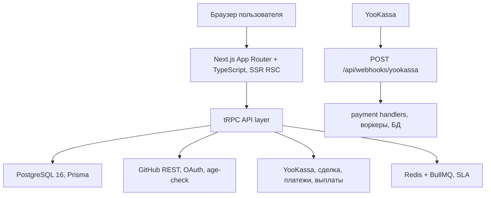

# Product Requirements Document — Referi

> Версия 1.0 · Дата: 2026-04-17 · Рынок: Российская Федерация

---

## 1. Executive Summary

### Problem Statement

Разработчики, ищущие работу, сталкиваются с тремя системными проблемами: (1) рекрутёры не дают обратной связи; (2) реферальная система внутри компаний непрозрачна и не мотивирует сотрудников участвовать активно; (3) спамные отклики снижают качество подбора и перегружают реферальщиков, которые в итоге игнорируют кандидатов.

### Proposed Solution

Referi — реферальная job-board для разработчиков (РФ), в которой сотрудник компании размещает вакансию, лично отбирает кандидатов и рефералит их за денежное вознаграждение, защищённое **безопасной сделкой ЮKassa**: средства удерживаются у платёжного провайдера до выполнения условий сделки, без отдельного эскроу-счёта Referi. Система сдержек и противовесов (лимиты, SLA, санкции, защищённая оплата) предотвращает злоупотребления со стороны обеих сторон.

### Success Criteria

| KPI                                                                  | Целевое значение | Срок                        |
| -------------------------------------------------------------------- | ---------------- | --------------------------- |
| Доля откликов, получивших ответ реферальщика в SLA (7 дней)          | ≥ 60%            | через 3 месяца после релиза |
| Доля возвратов по защищённым платежам от общего объёма транзакций   | ≤ 10%            | через 6 месяцев             |
| Количество успешных офферов (соискатель принял предложение компании) | ≥ 50             | через 6 месяцев             |
| Среднее время от отклика до перехода в `awaitingCompanyDecision`     | ≤ 14 дней        | через 3 месяца              |
| Доля вакансий, закрытых без нарушения SLA                            | ≥ 75%            | через 6 месяцев             |

---

## 2. User Experience & Functionality

### 2.1 User Personas

#### Persona 1 — Соискатель (Seeker)
- **Кто**: разработчик, активно ищущий работу или открытый к предложениям.
- **Цель**: найти работу через внутреннего реферальщика, который знает компанию изнутри и увеличит шансы на прохождение собеседования.
- **Боль**: не знает, куда отправить резюме, не получает обратной связи от рекрутёров, не доверяет анонимным рефералкам.

#### Persona 2 — Реферальщик (Referrer)
- **Кто**: действующий разработчик в компании, знающий, кого ищет команда.
- **Цель**: помочь коллегам найти хороших кандидатов и получить денежное вознаграждение за успешный реферал.
- **Боль**: получает слабых кандидатов из общего потока; нет инструмента для управления откликами; не защищён от мошенничества со стороны кандидатов.

#### Persona 3 — Модератор
- **Кто**: сотрудник Referi, разрешающий споры между соискателем и реферальщиком.
- **Цель**: вынести объективное решение по спору и управлять санкциями.
- **Инструмент**: admin-панель (`/admin`).

#### Persona 4 — Администратор
- **Кто**: технический сотрудник Referi, управляющий конфигурацией сервиса.
- **Цель**: настройка бизнес-правил (SLA, тарифы, санкции), мониторинг состояния системы.
- **Инструмент**: admin-панель Next.js.

---

### 2.2 User Stories & Acceptance Criteria

---

#### Epic 1: Регистрация и авторизация

**US-001** — Регистрация через GitHub
*As a* пользователь, *I want to* войти через свой GitHub-аккаунт, *so that* мне не нужно создавать отдельный пароль.

**AC:**
- При нажатии «Войти через GitHub» открывается стандартный OAuth-флоу GitHub.
- После успешной OAuth-авторизации сервис запрашивает `GET /user` GitHub REST API и считывает поле `created_at`.
- Если аккаунт создан ≥ 365 дней назад — регистрация бесплатна, пользователь перенаправляется в личный кабинет.
- Если аккаунт создан < 365 дней назад — пользователю показывается страница с объяснением ограничения и предложением оплатить разовый сбор **50 000 ₽** (фиксированная продуктовая сумма в бизнес-правилах приложения).
- После оплаты сбора пользователь регистрируется. Деньги не возвращаются.
- Попытка повторной оплаты тем же GitHub-аккаунтом невозможна (идемпотентность).

**US-002** — Профиль пользователя
*As a* пользователь, *I want to* заполнить свой профиль после регистрации, *so that* сервис и другие участники знали, кто я.

**AC:**
- Пользователь может указать: имя/псевдоним, контактную информацию (мессенджер, email, ссылка), краткую биографию (≤ 1000 символов). Участие как соискателя или как автора вакансии не привязано к отдельным «ролям аккаунта»: один и тот же пользователь может и откликаться, и публиковать вакансию в рамках правил платформы.
- Контактная информация соискателя видна только реферальщику данной вакансии.
- Реферальщики своих контактов в сервисе не публикуют; соискатели не видят имя/контакты реферальщика до момента, пока тот сам с ними не свяжется.
- В разделе «Настройки аккаунта» пользователь может безвозвратно удалить свой аккаунт после явного подтверждения в диалоге; удаляются связанные данные в сервисе (профиль, вакансии, заявки — в том числе заявки других пользователей на вакансии удаляемого реферера, пресеты поиска, подписка и связанные платежные записи там, где они были только у этого пользователя).
- Перед удалением выполняются синхронные расчёты по активному эскроу и возвраты по неиспользованным оплаченным токенам отклика по правилам платежей; отложенные задачи SLA/BullMQ, привязанные к пользователю и его заявкам/вакансиям, отменяются.
- Удаление из интерфейса недоступно для аккаунтов с непустым `staffRoles` (персонал обслуживается вне этого потока).

---

#### Epic 2: Вакансии

**US-003** — Создание вакансии реферальщиком
*As a* реферальщик, *I want to* создать вакансию, *so that* соискатели могли откликнуться на неё.

**AC:**
- Форма вакансии: название должности, название компании, специальность (выпадающий список: Frontend, Backend, Fullstack, Mobile, DevOps, QA, Data, ML/AI, Security, Other), грейд (Junior / Middle / Senior / Lead / Principal), формат работы (Офис / Гибрид / Удалёнка), зарплатная вилка (от / до, RUB, опционально), описание (≤ 3000 симв.), сумма вознаграждения реферальщика (RUB, опционально; 0 означает бесплатный реферал).
- Реферальщик не может создать вторую активную вакансию, если уже есть одна. Кнопка «Создать вакансию» заблокирована с пояснением.
- Реферальщик не может создавать вакансии, если его глобальный пул попыток = 0. Кнопка заблокирована с пояснением и датой следующей регенерации попытки.
- Вакансия не показывает соискателям контактную информацию или имя реферальщика.

**US-004** — Лента вакансий с фильтрами
*As a* соискатель, *I want to* искать вакансии по нескольким параметрам, *so that* видеть только релевантные предложения.

**AC:**
- Лента содержит все активные вакансии с пагинацией (20 на страницу).
- Фильтры: специальность (мультиселект), грейд (мультиселект), формат работы (чекбоксы), зарплата от/до (слайдер), текстовый поиск по названию/описанию (full-text, ILIKE).
- Вакансии, замороженные по SLA или исчерпанию попыток, скрыты из ленты.
- Закрытые и удалённые вакансии не отображаются.
- Сортировка: по дате публикации (по умолчанию), по зарплате.

**US-005** — Удаление вакансии реферальщиком
*As a* реферальщик, *I want to* удалить свою вакансию, *so that* она более не была доступна.

**AC:**
- Реферальщик может удалить вакансию вручную в любой момент.
- Все активные заявки по этой вакансии (в состояниях `submitted`, `awaitingPayment`, `awaitingResumeHandoff`, `awaitingCompanyDecision`, `seekerCancelRequested`) переводятся в состояние `refundedByVacancyDeleted`.
- Если по заявке уже была оплата в рамках безопасной сделки — средства незамедлительно возвращаются соискателю через сценарий возврата ЮKassa.
- Ручное удаление не уменьшает пул попыток реферальщика.
- После удаления вакансия более не отображается нигде, кроме архива в admin-панели.

---

#### Epic 3: Отклики

В user stories этого эпика статусы заявки даны в **удобочитаемом виде** (например `` `submitted` ``, `` `awaitingPayment` ``). В реализации они совпадают с перечислением Prisma **`ApplicationStatus`** в форме `SUBMITTED`, `AWAITING_PAYMENT`, `SEEKER_CANCEL_REQUESTED` и т.д.; полная матрица переходов — в [spec-process-application-lifecycle.md](../spec/spec-process-application-lifecycle.md).

**US-006** — Отправка отклика
*As a* соискатель, *I want to* откликнуться на вакансию, *so that* реферальщик увидел мою кандидатуру.

**AC:**
- При отклике соискатель заполняет: контактная информация (мессенджер или email, обязательно), краткая биография (≤ 1000 симв., обязательно), cover letter (≤ 300 симв., опционально).
- Соискатель не может иметь более 2 активных откликов одновременно (бесплатный лимит). Кнопка «Откликнуться» заблокирована с пояснением.
- С подпиской «Соискатель PRO» лимит расширяется до 5 активных откликов.
- Разовая покупка отклика снимает ограничение для одной конкретной вакансии.
- Соискатель не может повторно откликнуться на вакансию, по которой у него уже есть активная или завершённая заявка.

**US-007** — Просмотр откликов реферальщиком
*As a* реферальщик, *I want to* видеть список откликнувшихся соискателей, *so that* выбрать кого рассматривать.

**AC:**
- Реферальщик видит список заявок в статусе `submitted`: отображаются контактная информация, краткая биография и cover letter (если заполнен).
- Имя соискателя в системе отображается реферальщику (публичный псевдоним).
- Реферальщик НЕ видит заявки других реферальщиков на этого соискателя.

**US-008** — Подтверждение намерения рефералить
*As a* реферальщик, *I want to* подтвердить, что хочу рефералить конкретного кандидата, *so that* продолжить процесс.

**AC:**
- Реферальщик связывается с соискателем по контактной информации из заявки вне сервиса (мессенджер/почта).
- В сервисе реферальщик нажимает «Хочу рефералить» — заявка переходит в `awaitingPayment`.
- Реферальщик не может подтвердить более 1 кандидата одновременно (жёсткий лимит).
- Если пул попыток = 0 — подтверждение невозможно.
- При подтверждении пул попыток уменьшается на 1 (резервирование; при отмене/отказе компании — попытка не возвращается; при ручном удалении вакансии — возвращается).

**US-009** — Отклонение кандидата реферальщиком
*As a* реферальщик, *I want to* отклонить кандидата, *so that* разблокировать слот рассмотрения.

**AC:**
- Реферальщик может отклонить заявку в статусе `submitted`.
- Заявка переходит в `rejectedByReferrer`.
- Соискатель освобождает слот активного отклика и может откликнуться на другую вакансию.
- Пул попыток реферальщика НЕ уменьшается при отклонении на стадии `submitted`.

**US-010** — Отзыв отклика соискателем
*As a* соискатель, *I want to* отозвать свой отклик, *so that* освободить слот для другой вакансии.

**AC:**
- Соискатель может отозвать заявку в статусе `submitted` или `awaitingPayment` (до оплаты).
- Заявка переходит в `cancelled`.
- Слот активного отклика освобождается.

---

#### Epic 4: Платежи и безопасная сделка ЮKassa

**US-011** — Оплата вознаграждения реферальщику
*As a* соискатель, *I want to* оплатить вознаграждение через безопасную сделку ЮKassa, *so that* реферальщик передал моё резюме HR, а средства оставались у провайдера до выполнения условий.

**AC:**
- После перехода в `awaitingPayment` соискатель видит сумму и кнопку «Оплатить».
- Если вакансия не предполагает вознаграждения (сумма = 0) — заявка автоматически переходит в `awaitingResumeHandoff` без платежа.
- Если сумма > 0 — соискатель оплачивает через ЮKassa (карта и другие доступные способы приёма).
- После успешного подтверждения от ЮKassa (webhook) платёж участвует в **безопасной сделке**: сумма удерживается у ЮKassa на срок жизни сделки (по [документации API](https://yookassa.ru/developers/solutions-for-platforms/safe-deal/basics) — от 1 до 180 дней; маркетинговая страница допускает иные формулировки сроков — **источник истины для интеграции — раздел Developers**). На расчётный счёт Referi в этой модели в основном зачисляется **комиссия маркетплейса**, а не полная сумма вознаграждения реферальщика.
- Заявка переходит в `awaitingResumeHandoff`.
- Если соискатель не оплатил в течение 5 дней — заявка переходит в `cancelled`, слот освобождается.

**US-012** — Выплата реферальщику
*As a* реферальщик, *I want to* получить вознаграждение после успешного трудоустройства кандидата, *so that* быть мотивированным рефералить качественно.

**AC:**
- При подтверждении соискателем принятия оффера (`offerAccepted`) сервис автоматически инициирует завершение сделки в пользу исполнителя (выплата реферальщику в терминологии Safe deal).
- Сумма к выплате реферальщику: сумма сделки минус комиссия сервиса (10%); комиссия платформы — по правилам подключённого продукта ЮKassa.
- Выплата на карту (или иной поддерживаемый способ) реферальщика выполняется через API ЮKassa в рамках безопасной сделки.
- Вакансия автоматически удаляется.

**US-013** — Возврат средств
*As a* соискатель, *I want to* получить обратно деньги в случае отказа, *so that* не потерять средства при неудаче.

**AC:**
- Возврат заказчику инициируется автоматически в следующих случаях: SLA передачи резюме истёк (`refundedBySLA`), соискатель запросил отказ и реферальщик подтвердил (`refundedByCancelAck`), реферальщик не ответил на запрос отказа в 3 дня (`refundedByCancelAuto`), реферальщик удалил вакансию (`refundedByVacancyDeleted`), модератор решил в пользу соискателя (`refundedByModerator`).
- Срок зачисления на карту: до 10 рабочих дней (зависит от банка и сценария возврата ЮKassa).

---

#### Epic 5: Передача резюме и решение компании

**US-014** — Подтверждение передачи резюме HR
*As a* реферальщик, *I want to* подтвердить, что передал резюме кандидата HR, *so that* продвинуть заявку дальше.

**AC:**
- В статусе `awaitingResumeHandoff` реферальщик видит кнопку «Подтвердил передачу резюме HR».
- Нажатие переводит заявку в `awaitingCompanyDecision`.
- Если реферальщик не подтвердил в течение 5 дней — срабатывает SLA: деньги возвращаются соискателю (`refundedBySLA`), реферальщик получает бан на 30 дней (запрет брать новых кандидатов в рассмотрение).

**US-015** — Запрос соискателем отказа от заявки
*As a* соискатель, *I want to* запросить отказ от своей заявки в стадии `awaitingResumeHandoff`, *so that* освободить слот и вернуть деньги, если реферальщик бездействует.

**AC:**
- В статусе `awaitingResumeHandoff` соискатель видит кнопку «Запросить отмену заявки».
- Нажатие переводит заявку в `seekerCancelRequested` и уведомляет реферальщика.
- Реферальщик подтверждает в течение 3 дней — деньги возвращаются (`refundedByCancelAck`).
- Если реферальщик не реагирует 3 дня — деньги возвращаются автоматически (`refundedByCancelAuto`).
- После возврата слот активного отклика соискателя освобождается.

**US-016** — Результат решения компании
*As a* соискатель, *I want to* сообщить о результате взаимодействия с компанией, *so that* завершить сделку.

**AC:**
- В статусе `awaitingCompanyDecision` соискатель видит две кнопки: «Принял оффер» и «Получил отказ».
- «Принял оффер» → переход в `offerAccepted`, автоматический запуск выплаты реферальщику.
- «Получил отказ» → сервис уведомляет реферальщика. Реферальщик должен подтвердить факт отказа.
  - Оба подтвердили → `rejectedByCompany`, деньги возвращаются соискателю.
  - Реферальщик не соглашается → `disputed`, подключается модератор.

---

#### Epic 6: Споры и модерация

**US-017** — Разрешение спора модератором
*As a* модератор, *I want to* изучить спор и вынести решение, *so that* средства ушли справедливой стороне.

**AC:**
- При переходе в `disputed` модератор видит спор в admin-панели (очередь открытых кейсов).
- Модератор изучает ситуацию вне сервиса (переписка сторон, контекст).
- В admin-панели модератор нажимает «Решить в пользу реферальщика» (→ `offerAccepted`) или «Решить в пользу соискателя» (→ `refundedByModerator`).
- Решение необратимо; стороны видят итог в личном кабинете (исходящих писем из сервиса нет).

**US-018** — Жалоба на вакансию или пользователя
*As a* пользователь, *I want to* пожаловаться на фейковую вакансию или мошенничество, *so that* защитить себя и других.

**AC:**
- На странице каждой вакансии есть кнопка «Пожаловаться».
- При нажатии открывается форма: причина (выпадающий список: Фейковая вакансия, Некорректное поведение, Мошенничество, Другое), комментарий (≤ 500 симв.).
- Жалоба сохраняется в системе; модераторы обрабатывают её через admin-панель.
- После отправки пользователь видит подтверждение; при настройке `NEXT_PUBLIC_MODERATION_CONTACT_URL` — ссылку для связи с модерацией вне приложения (например, открытый контакт в мессенджере).
- Если жалоба подтверждена — модератор может заблокировать вакансию или пользователя через admin-панель.

---

#### Epic 7: Лимиты, санкции и пул попыток

**US-019** — Пул попыток реферальщика
*As a* реферальщик, *I want to* понимать, сколько попыток у меня осталось и когда они восстановятся, *so that* планировать своё участие.

**AC:**
- На дашборде реферальщика отображается: текущий пул попыток (0–3), дата регенерации следующей попытки (если пул < 3).
- Попытка тратится при переходе заявки в `awaitingPayment` (подтверждение намерения рефералить).
- Попытка НЕ восстанавливается при: отказе компании, истечении любого SLA.
- Попытка восстанавливается автоматически через 60 дней от момента её траты.
- Ручное удаление вакансии реферальщиком возвращает потраченные на её активные заявки попытки.

**US-020** — Фриз вакансии
*As a* система, *I want to* заморозить вакансию при нарушении SLA реакции, *so that* стимулировать реферальщика к активности.

**AC:**
- Если в течение 7 дней после появления первого отклика реферальщик не взял ни одного кандидата в рассмотрение — вакансия замораживается на 14 дней.
- Замороженная вакансия не отображается в ленте.
- Существующие заявки в статусе `submitted` остаются, но новые отклики заблокированы.
- Реферальщик получает уведомление о заморозке и дате разморозки.
- После разморозки вакансия снова появляется в ленте.
- Повторное нарушение SLA → повторная заморозка (кумулятивно).

**US-021** — Подписка «Соискатель PRO»
*As a* соискатель, *I want to* приобрести подписку, *so that* иметь возможность откликаться на большее число вакансий одновременно.

**AC:**
- Подписка «Соискатель PRO» стоит 499 ₽/мес.
- С подпиской лимит активных откликов увеличивается с 2 до 5 (при статусе `ACTIVE` и неистёкшем оплаченном периоде `currentPeriodEnd`).
- Подписка оформляется через ЮKassa с сохранением метода оплаты (`save_payment_method`) и активирует период на 30 дней. Следующие периоды оплачиваются **автоплатежами** ЮKassa: платёж создаётся по сохранённому `payment_method_id` без повторного редиректа; расписание инициирует очередь BullMQ (`payments`: джоб `subscription-renewal` на конец текущего периода). При неудаче автосписания статус `PAST_DUE`, повторные попытки с задержкой по правилам из [`businessRules`](src/shared/constants/businessRules.ts); после исчерпания попыток доступ PRO восстанавливается только через повторную оплату (`subscriptions.initiatePro`).
- При отмене подписки (`subscriptions.cancel`) лимит новых откликов возвращается к 2 сразу; автопродление прекращается. Активные сверхлимитные отклики сохраняются до завершения.

**US-022** — Разовая покупка отклика
*As a* соискатель, *I want to* купить дополнительный отклик разово, *so that* откликнуться на конкретную вакансию без подписки.

**AC:**
- Стоимость одного дополнительного отклика: 199 ₽.
- Покупка привязана к конкретной вакансии и действительна 30 дней или до закрытия/удаления вакансии.
- После использования (отклика) токен расходуется.
- Возврат за неиспользованный токен: если вакансия удалена — токен возвращается как деньги.

---

### 2.3 Non-Goals

Следующее **не входит** в scope Referi v1.0:

1. **Активная верификация работодателя** — сервис не проверяет принадлежность реферальщика к компании. Только реактивная мера: соискатель может подать жалобу через форму на сайте после самостоятельной проверки по рабочей почте и при необходимости связаться с модерацией по публичной ссылке контакта.
2. **Хранение резюме и файлов** — сервис не предоставляет хранилище документов. Обмен файлами происходит напрямую между соискателем и реферальщиком вне сервиса.
3. **Встроенный чат** — общение между соискателем и реферальщиком происходит через контактную информацию, указанную в профиле, вне сервиса.
4. **Подписка для реферальщика** — все лимиты реферальщика жёсткие и не расширяются.
5. **Мобильные приложения** (iOS/Android) — только веб-версия.
6. **Мультиязычность** — только русский интерфейс.
7. **Интеграция с hh.ru / LinkedIn / Habr Career** — вне scope.
8. **Корпоративные аккаунты** — каждый реферальщик регистрируется индивидуально.

---

## 3. Technical Specifications

### 3.1 Architecture Overview

**Браузер** ходит в `Next` / `tRPC`; **внешние** сервисы пушат события в `POST` маршруты, не в tRPC-роуты.

Детальная архитектурная спецификация — в [`spec/spec-architecture-referi-system.md`](../spec/spec-architecture-referi-system.md).

### 3.2 Integration Points

| Интеграция          | Назначение                    | Ключевые данные                 |
| ------------------- | ----------------------------- | ------------------------------- |
| GitHub OAuth 2.0    | Аутентификация, age-check     | `access_token`, `created_at`    |
| ЮKassa Safe deal    | Сделки между соискателем и реферальщиком: приём, удержание, возврат, выплата исполнителю, комиссия маркетплейса | идентификаторы сделки и платежа, `status`, подпись вебхука; см. [интеграцию](https://yookassa.ru/developers/solutions-for-platforms/safe-deal/integration/payments) |
| ЮKassa Payments API | Обычные платежи (регистрация, подписка, токены отклика), не заявка | `payment_id`, `status`          |
| ЮKassa Payouts API  | Выплаты физлицам в составе Safe deal и отдельные сценарии | `payout_id`, реквизиты получателя |
| Публичный контакт модерации | Опционально: ссылка в UI (`NEXT_PUBLIC_MODERATION_CONTACT_URL`) для связи вне приложения | HTTPS URL, задаётся в конфигурации |

### 3.3 Security & Privacy

- **Минимум PII**: сервис хранит только контактную информацию, указанную соискателем добровольно. Резюме и файлы не хранятся.
- **Изоляция данных**: контакты соискателя доступны только реферальщику конкретной вакансии и только после того, как заявка находится в активном статусе.
- **Аудит-лог**: все переходы состояний заявки фиксируются в таблице `AuditLog` с timestamp и actor.
- **Платёжные данные**: Referi не хранит данные карт. Все транзакции обрабатываются на стороне ЮКассы.
- **Вебхуки**: ЮКасса — верификация `Authorization: Basic base64(shopId:secretKey)`.
- **Rate limiting** (при `FEATURE_RATE_LIMITING=true`, Redis, [`src/app/api/trpc/[trpc]/route.ts`](../src/app/api/trpc/%5Btrpc%5D/route.ts)): неаутентифицированные запросы к tRPC — до 60 req/мин на IP; аутентифицированные — до 120 req/мин на пользователя (скользящее окно; см. [`spec/spec-design-api.md`](../spec/spec-design-api.md) §4.10).
- **HTTPS only**: все соединения только по TLS 1.2+.

### 3.4 Technology Stack

| Слой           | Технология                                                   |
| -------------- | ------------------------------------------------------------ |
| Фронтенд       | Next.js 16+ (App Router), TypeScript, Tailwind CSS, shadcn/ui |
| API            | tRPC v11 (type-safe), REST для вебхуков                      |
| БД             | PostgreSQL 16, Prisma 7 (`schema.prisma` + `prisma.config.ts`) |
| Auth           | Auth.js v5 (NextAuth) + GitHub OAuth                         |
| Платежи        | ЮKassa API v3, абстракция `PaymentProvider`; заявки с вознаграждением — **безопасная сделка** |
| Очереди        | BullMQ + Redis                                               |
| Модерация      | Admin-панель Next.js: споры (`ModeratorCase`), жалобы (`AbuseReport`); опционально ссылка контакта в UI |
| Тесты          | Vitest, Playwright, fast-check                               |
| Инфраструктура | Docker Compose (dev), Yandex Cloud / VPS (prod)              |

---

## 4. Risks & Roadmap

### 4.1 Technical Risks

| Риск                                                      | Вероятность | Влияние | Митигация                                                         |
| --------------------------------------------------------- | ----------- | ------- | ----------------------------------------------------------------- |
| Сбой вебхука ЮКассы → потеря подтверждения платежа        | Средняя     | Высокое | Идемпотентный обработчик + polling состояния платежа каждые 5 мин |
| Дублирование SLA-задач в BullMQ при рестарте воркера      | Средняя     | Среднее | Уникальные jobId per application, `removeOnComplete`              |
| Мошенничество: соискатель заявляет отказ, но принял оффер | Средняя     | Высокое | Механизм спора + модерация; штраф за ложное заявление (бан)       |
| GitHub аккаунт < 1 года: массовая покупка за $500 equiv   | Низкая      | Среднее | Анализ паттернов; ручная модерация при подозрении                 |
| Пользователи реже заходят в ЛК и пропускают дедлайны            | Средняя     | Среднее | Явные дедлайны в UI; при необходимости внешние каналы связи вне продукта |
| Платёжный продукт и договор с ЮKassa (в т.ч. порог оборота, подключение через менеджера) | Средняя | Высокое | Юридическое сопровождение; соблюдение условий маркетплейса и Safe deal; мониторинг изменений оферты ЮKassa |

### 4.2 Phased Roadmap

#### Phase 0 — Foundation (Sprint 1)
Инфраструктура: Next.js + Prisma + Docker Compose + CI (lint/test).

#### Phase 1 — Auth (Sprint 1-2)
GitHub OAuth + age-check + платная регистрация.

#### Phase 2 — Vacancies & Profiles (Sprint 2-3)
Профили пользователей + CRUD вакансий + лента с фильтрами + форма отклика.

#### Phase 3 — Application Lifecycle Core (Sprint 3-4)
Машина состояний отклика + лимиты + запрет показа данных реферальщика + `seekerCancelRequested`.

#### Phase 4 — Payments & Safe deal (Sprint 4-5)
Интеграция ЮKassa: **безопасная сделка** по заявкам с вознаграждением, подписка Соискатель PRO, разовая покупка отклика (обычные платежи вне сделки).

#### Phase 5 — SLA & Automation (Sprint 5-6)
BullMQ-таймеры + авто-санкции + фриз вакансий + глобальный пул попыток + 60-дневная регенерация + авто-удаление вакансии при успехе.

#### Phase 6 — Disputes & Moderation (Sprint 6-7)
Споры и жалобы: admin-панель; опционально публичная ссылка для связи с модерацией вне приложения.

#### Phase 7 — Polish & Production (Sprint 7-8)
Полировка UI + e2e Playwright + деплой в прод.

#### v1.1 (Post-launch)
Расширенная аналитика для реферальщика, дополнительные каналы уведомлений (по продуктовому решению), базовый антифрод.

#### v2.0
Верификация работодателя через корп. email, API для интеграции с ATS, рейтинг реферальщиков.

---

*Документ является живым. Версия 1.0 фиксирует требования на момент начала разработки. Изменения вносятся с указанием версии и даты.*
