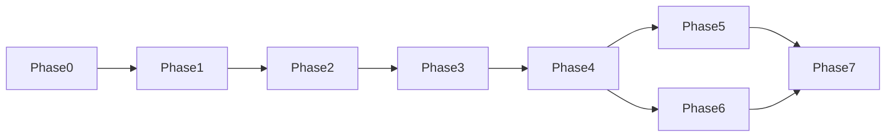

# Referi — Implementation Roadmap

> Версия 1.0 · Дата: 2026-04-17

Дорожная карта разбита на 8 фаз (Phase 0–7). Каждая фаза имеет чёткий набор deliverables и критерии готовности (Definition of Done). Фичи помечены флагами `[CORE]` / `[PAY]` / `[MOD]` / `[AUTO]` для понимания зависимостей.

---

## Зависимости между фазами




Порядок 5–6 в списке фаз условен: ветки Phase5 и Phase6 **параллельны** и обе стартуют после Phase4.

Фазы 0–3 — строго последовательны. Фазы 5–6 могут вестись параллельно после завершения Phase 4.

---

## Phase 0 — Foundation

**Цель**: работающее пустое приложение с полной инфраструктурой разработки.

### Deliverables


| Задача                                  | Флаг     | Описание                                                                               |
| --------------------------------------- | -------- | -------------------------------------------------------------------------------------- |
| Инициализация Next.js (App Router)      | `[CORE]` | `create-next-app` с App Router, TypeScript strict, Tailwind CSS (текущая ветка — 16.x) |
| Prisma + PostgreSQL                     | `[CORE]` | `prisma init`, базовая конфигурация, первая пустая миграция                            |
| Docker Compose                          | `[CORE]` | `postgres:16`, `redis:7`, `app` сервисы; `docker-compose.yml` для dev                  |
| Redis + BullMQ                          | `[CORE]` | Клиент Redis, базовая очередь, тест подключения                                        |
| Auth.js v5 базовая                      | `[CORE]` | Установка, настройка провайдера (без реального GitHub OAuth пока)                      |
| tRPC v11                                | `[CORE]` | `initTRPC`, базовый `appRouter`, `superjson` transformer                               |
| CI pipeline                             | `[CORE]` | GitHub Actions: `lint` (ESLint + Prettier), `typecheck`, `test` (Vitest)               |
| `.env.example`                          | `[CORE]` | Все переменные окружения с описаниями                                                  |
| `src/shared/constants/businessRules.ts` | `[CORE]` | Все SLA, тарифы, лимиты из спецификации                                                |
| shadcn/ui                               | `[CORE]` | Установка, базовые компоненты: Button, Card, Input, Badge, Dialog                      |


### Definition of Done

- `docker compose up` поднимает приложение без ошибок
- `npm run lint && npm run typecheck && npm run test` проходят
- `prisma migrate dev` выполняется без ошибок
- `GET /` — каталог рефералок; фильтры, поиск и пагинация **не меняют** строку адреса; данные ленты — `**trpc.vacancies.list`** на клиенте с гидратацией из первого SSR; без полной перезагрузки документа
- CI pipeline зелёный на пустом PR

---

## Phase 1 — Authentication & Registration

**Цель**: полный флоу регистрации через GitHub с age-check и платной регистрацией.

### Deliverables


| Задача                             | Флаг     | Описание                                                            |
| ---------------------------------- | -------- | ------------------------------------------------------------------- |
| GitHub OAuth провайдер             | `[CORE]` | Auth.js + реальный GitHub OAuth App                                 |
| Age-check в signIn callback        | `[CORE]` | `GET /user` → `created_at` → проверка 365 дней                      |
| Полная Prisma schema               | `[CORE]` | Все модели из `spec-schema-database.md`; миграции                   |
| Страница `/login`                  | `[CORE]` | Кнопка «Войди через GitHub», обработка ошибок                       |
| Страница `/registration/age-gate`  | `[CORE]` | Объяснение + кнопка оплаты сбора                                    |
| `auth.initiateRegistrationPayment` | `[PAY]`  | tRPC **public** mutation `{ userId }`; ЮКасса / MockPaymentProvider |
| Обработка webhook регистрации      | `[PAY]`  | `payment.succeeded` → `paidRegistration = true`                     |
| Профиль пользователя               | `[CORE]` | Страница `/profile`; `auth.updateProfile` mutation        |
| Middleware защита роутов           | `[CORE]` | Редирект на `/login` для неавторизованных                           |
| `auth.me` query                    | `[CORE]` | Данные текущего пользователя + staff-флаги + попытки                |


### Definition of Done

- Пользователь с GitHub аккаунтом > 1 года может войти и видит кабинет
- Пользователь с GitHub аккаунтом < 1 года попадает на age-gate страницу
- MockPaymentProvider позволяет «оплатить» сбор и войти
- `GitHubProfile.accessToken` зашифрован в БД
- Unit-тест на age-check с мок-датами (< 365 дней, > 365 дней)

---

## Phase 2 — Vacancies & Profiles

**Цель**: реферальщики могут создавать рефералки; соискатели — просматривать ленту с фильтрами.

### Deliverables


| Задача                          | Флаг     | Описание                                                                                                  |
| ------------------------------- | -------- | --------------------------------------------------------------------------------------------------------- |
| `vacancies.create` mutation     | `[CORE]` | Guard: 1 активная рефералка, пул попыток > 0                                                               |
| `vacancies.delete` mutation     | `[CORE]` | Cascade refund (пока без реальных денег)                                                                  |
| `vacancies.list` query          | `[CORE]` | Фильтры: specialty, grade, workFormat, salaryCurrency, salary, query; пагинация |
| `vacancySearchPresets` router   | `[CORE]` | Сохранённые наборы фильтров каталога: list/create/update/delete                                           |
| `vacancies.getById` query       | `[CORE]` | Без данных реферальщика                                                                                   |
| `vacancies.myActive` query      | `[CORE]` | Текущая рефералка реферальщика                                                                             |
| Страница `/` — лента рефералок   | `[CORE]` | Карточки, сайдбар фильтров, поиск и сортировка, пресеты для авторизованных                                |
| Страница `/vacancies/[id]`      | `[CORE]` | Детальная страница рефералки + кнопка «Попросить рефералку»                                                       |
| Страница `/vacancy`   | `[CORE]` | Реферальщик: создание рефералки; при активной — экран со ссылкой на `/vacancies/[id]` и на редактирование (`?edit=1`); редактирование полей в кабинете |
| Страница `/vacancies/new`       | `[CORE]` | Оформление новой рефералки без входа; OAuth GitHub при публикации, черновик формы в `sessionStorage` до авторизации                                                      |
| Форма создания рефералки         | `[CORE]` | Все поля из spec; валидация Zod                                                                           |
| `ReferrerAttemptLedger` базовый | `[CORE]` | `getAvailableAttempts()` возвращает корректное значение                                                   |
| Full-text поиск                 | `[CORE]` | `pg_trgm` или `tsvector` для title/description                                                            |


### Definition of Done

- Реферальщик создаёт рефералку; вторая попытка создать рефералку заблокирована
- Лента отображает активные рефералки с корректными фильтрами
- Замороженные/удалённые рефералки не отображаются в ленте
- Full-text поиск по названию и описанию работает
- Unit-тесты на guard «1 активная рефералка»

---

## Phase 3 — Application Lifecycle (Core)

**Цель**: полный цикл заявки без реальных платежей; машина состояний работает полностью.

### Deliverables


| Задача                                    | Флаг     | Описание                                             |
| ----------------------------------------- | -------- | ---------------------------------------------------- |
| `applications.submit` mutation            | `[CORE]` | Guard: лимит 2, статус рефералки, уникальность пары   |
| `applications.cancel` mutation            | `[CORE]` | SUBMITTED / AWAITING_PAYMENT                         |
| `applications.confirmIntent` mutation     | `[CORE]` | Guards: попытки, активное рассмотрение, статус       |
| `applications.reject` mutation            | `[CORE]` | SUBMITTED → REJECTED_BY_REFERRER                     |
| `applications.confirmHandoff` mutation    | `[CORE]` | AWAITING_RESUME_HANDOFF → AWAITING_COMPANY_DECISION  |
| `applications.requestCancel` mutation     | `[CORE]` | AWAITING_RESUME_HANDOFF → SEEKER_CANCEL_REQUESTED    |
| `applications.acknowledgeCancel` mutation | `[CORE]` | SEEKER_CANCEL_REQUESTED → REFUNDED_BY_CANCEL_ACK     |
| `applications.acceptOffer` mutation       | `[CORE]` | AWAITING_COMPANY_DECISION → OFFER_ACCEPTED           |
| `applications.reportRejection` mutation   | `[CORE]` | Со стороны соискателя                                |
| `applications.confirmRejection`           | `[CORE]` | Реферальщик подтверждает отказ → REJECTED_BY_COMPANY |
| `applications.denyRejection`              | `[CORE]` | Реферальщик опровергает → DISPUTED                   |
| `AuditLog` запись при каждом переходе     | `[CORE]` | Все поля: from, to, actor, actorId, metadata         |
| `applications.myList` query               | `[CORE]` | Список заявок соискателя с текущими статусами        |
| `vacancies.update` mutation               | `[CORE]` | Реферальщик: обновление полей своей рефералки (ACTIVE / FROZEN)               |
| `vacancies.applicants` query              | `[CORE]` | Список соискателей, отправивших запрос, для реферальщика (UI: блок на `/vacancies/[id]` для автора)               |
| Страница `/applications`        | `[CORE]` | Соискатель: мои заявки + действия                    |
| Правила видимости контактов               | `[CORE]` | contactInfo только в активных статусах               |
| Property-based тесты state machine        | `[CORE]` | fast-check, инварианты INV-001..007                  |


### Definition of Done

- Полный happy path от submit до offerAccepted работает без реальных платежей
- Все guards из spec-process-application-lifecycle.md проверены unit-тестами
- `AuditLog` создаётся при каждом переходе
- `contactInfo` не виден в `vacancies.applicants` после терминального статуса
- Соискатель не может иметь более 2 активных заявок по рефералкам одновременно (см. guard в spec-process-application-lifecycle.md)

---

## Phase 4 — Payments & YooKassa Safe deal

**Цель**: реальные платежи через ЮKassa; заявки с вознаграждением — **безопасная сделка** (удержание у провайдера, выплата исполнителю, возврат заказчику); подписки и разовые токены — обычные платежи.

### Deliverables


| Задача                                          | Флаг    | Описание                                                                                                                                           |
| ----------------------------------------------- | ------- | -------------------------------------------------------------------------------------------------------------------------------------------------- |
| `YookassaPaymentProvider`                       | `[PAY]` | Реализация `PaymentProvider`; целевой объём — API Safe deal + Payments                                                                             |
| `payments.initiateEscrow` mutation              | `[PAY]` | Старт оплаты соискателя по заявке; `confirmationUrl` / `paymentId`                                                                                 |
| Webhook `/api/webhooks/yookassa`                | `[PAY]` | Верификация Basic Auth (`shopId:secretKey`); диспетчеризация по `metadata.type`                                                                    |
| `paymentWorker`                                 | `[PAY]` | BullMQ: выплаты по сделке, возвраты, продление PRO (`subscription-renewal`, `subscription-renew-retry`)                                            |
| Закрытие в пользу исполнителя при offerAccepted | `[PAY]` | Шаги capture + payout (или эквивалент в API сделки)                                                                                                |
| `refundPayment` при всех refund-переходах       | `[PAY]` | Возврат заказчику: SLA, cancel, vacancy deleted, moderator                                                                                         |
| `payments.addPayoutCard` (бэклог)               | `[PAY]` | Отдельная tRPC-процедура не реализована; выплаты — воркер + `User.yookassaPayoutDestination`                                                       |
| `payments.initiatePaidApplicationToken`         | `[PAY]` | Покупка разового токена запроса через Payments API                                                                                                 |
| `PaidApplicationToken` использование            | `[PAY]` | При submit с токеном (`paidTokenId`) бесплатный лимит не проверяется                                                                               |
| `subscriptions.initiatePro`                     | `[PAY]` | Подписка PRO (499 ₽/мес); первый платёж через ЮКасса + сохранение метода; автопродление через автоплатежи (`subscription_renewal`) и джобы очереди |
| `subscriptions.cancel`                          | `[PAY]` | Отмена PRO; автосписания прекращаются                                                                                                              |
| `subscriptions.me`                              | `[PAY]` | Статус подписки, `autoRenewEnabled`                                                                                                                |
| Лимит 5 запросов с PRO                          | `[PAY]` | Guard в `applications.submit`: PRO при `ACTIVE` и неистёкшем `currentPeriodEnd` (`subscriptionGrantsProFeatures`)                                  |
| Polling fallback                                | `[PAY]` | BullMQ job если webhook не пришёл за 5 мин                                                                                                         |
| `calculateCommission`                           | `[PAY]` | Утилита + unit-тесты на граничные значения                                                                                                         |
| Страница оплаты (`/pay/[applicationId]`)        | `[PAY]` | Редирект на ЮКасса + обратный редирект                                                                                                             |


### Definition of Done

- Реальный тестовый платёж через ЮКасса sandbox проходит end-to-end
- Webhook с невалидной подписью возвращает 401
- Идемпотентность: повторный webhook не создаёт дубль транзакции
- Подписка PRO расширяет лимит до 5 запросов по рефералкам
- Комиссия рассчитывается корректно (тест на 10 000 ₽ → 1 000 ₽ комиссия)

---

## Phase 5 — SLA Timers & Automation

**Цель**: все SLA-таймеры работают; авто-санкции, фриз рефералок, регенерация попыток.

### Deliverables


| Задача                                    | Флаг     | Описание                                                                         |
| ----------------------------------------- | -------- | -------------------------------------------------------------------------------- |
| `slaWorker` — `reaction-sla`              | `[AUTO]` | Фриз рефералки через 7 дней без реакции                                           |
| `slaWorker` — `payment-deadline`          | `[AUTO]` | Отмена платежа через 5 дней                                                      |
| `slaWorker` — `resume-handoff-sla`        | `[AUTO]` | Возврат + бан реферальщика через 5 дней                                          |
| `slaWorker` — `cancel-ack-sla`            | `[AUTO]` | Авто-возврат через 3 дня                                                         |
| `slaWorker` — `company-decision-sla`      | `[AUTO]` | Авто-открытие спора через 30 дней                                                |
| `slaWorker` — `vacancy-unfreeze`          | `[AUTO]` | Разморозка рефералки через 14 дней                                                |
| `slaWorker` — регенерация попыток         | `[AUTO]` | Восстановление попытки через 60 дней (логика в `slaWorker`, не отдельный воркер) |
| Авто-удаление рефералки при OFFER_ACCEPTED | `[AUTO]` | Внутри команды `acceptOffer`                                                     |
| `vacancyDeletedCascade`                   | `[AUTO]` | Возврат средств и попыток при ручном удалении                                    |
| `ReferrerSanction` проверка в guards      | `[AUTO]` | `isReferrerBanned()` в `confirmReferralIntent`                                   |
| `deadline` поля в `Application`           | `[AUTO]` | Устанавливаются в командах; проверяются в воркерах                               |
| Уникальность `jobId` в BullMQ             | `[AUTO]` | Нет дубликатов при рестарте воркера                                              |
| Дашборд реферальщика: пул попыток         | `[AUTO]` | Отображение доступных попыток и дат регенерации                                  |


### Definition of Done

- Integration-тест: `resume-handoff-sla` срабатывает (mockdate + 5 дней) → деньги возвращены, бан создан
- Integration-тест: `reaction-sla` срабатывает → рефералка FROZEN, не в ленте
- Unit-тест: `getAvailableAttempts` = 3 при пустом ledger, 0 после 3 CONSUMED
- Тест на noop при изменившемся статусе заявки при срабатывании SLA
- `attempt-regen` не создаёт дубль `REGENERATED` при двойном срабатывании

---

## Phase 6 — Disputes & Moderation

**Цель**: модераторы разрешают споры и жалобы через admin-панель; пользователи при необходимости связываются с модерацией по публичной ссылке (`NEXT_PUBLIC_MODERATION_CONTACT_URL`).

### Deliverables


| Задача                                  | Флаг    | Описание                                                                                 |
| --------------------------------------- | ------- | ---------------------------------------------------------------------------------------- |
| `moderation.`* роутеры                  | `[MOD]` | Процедуры из spec-design-api (resolve, abuse reports)                                    |
| Admin-панель `/admin`                   | `[MOD]` | Список споров + жалоб + кнопки разрешения                                                |
| `reports.submitAbuseReport`             | `[MOD]` | tRPC mutation; запись `AbuseReport`                                                      |
| `moderation.resolveForReferrer`         | `[MOD]` | постановка выплаты по Safe deal (воркер) → закрыть `ModeratorCase`                       |
| `moderation.resolveForSeeker`           | `[MOD]` | refund → закрыть `ModeratorCase`                                                         |
| Страница `/applications/[id]` | `[MOD]` | История `AuditLog`; кнопка «Пожаловаться»                                                |
| Блокировка пользователя / рефералки      | `[MOD]` | `moderation.blockUser`; рефералка — флаг `blockVacancy` в `moderation.resolveAbuseReport` |
| UI контакта модерации                   | `[MOD]` | Ссылка из `NEXT_PUBLIC_MODERATION_CONTACT_URL` в настройках (`/settings`)    |


### Definition of Done

- Спор в статусе `DISPUTED` виден модератору в admin-панели
- Модератор через admin-панель разрешает спор → деньги уходят корректной стороне
- Жалоба из UI сохраняется и отображается модераторам в admin-панели

---

## Phase 7 — Polish, Notifications & Production

**Цель**: продакшн-готовое приложение с полным UI и e2e-тестами (событийные уведомления — только в продукте по мере появления каналов; исходящей почты из сервиса нет).

### Deliverables


| Задача                         | Флаг     | Описание                                                                                                                              |
| ------------------------------ | -------- | ------------------------------------------------------------------------------------------------------------------------------------- |
| Rate limiting (tRPC)           | `[CORE]` | `FEATURE_RATE_LIMITING` + Redis в `src/lib/rateLimiter.ts`, проверка в `src/app/api/trpc/[trpc]/route.ts` (см. spec-design-api §4.10) |
| Полировка UI                   | `[CORE]` | Единый UI shell (шапки, `--app-page-surface`, shadcn); адаптивность, accessibility (Lighthouse ≥ 95), темизация                       |
| Страница настроек пользователя | `[CORE]` | Профиль, подписка; опционально блок «Связь с модерацией» по `NEXT_PUBLIC_MODERATION_CONTACT_URL`                                      |
| Дашборд соискателя             | `[CORE]` | Все активные заявки с дедлайнами и действиями                                                                                         |
| Дашборд реферальщика           | `[CORE]` | Рефералка, список кандидатов, пул попыток                                                                                              |
| E2E-тесты Playwright           | `[CORE]` | Сценарии: регистрация, создание рефералки, полный цикл заявки, спор                                                                    |
| `docker-compose.prod.yml`      | `[CORE]` | Production конфигурация с env из secrets                                                                                              |
| CI/CD деплой                   | `[CORE]` | GitHub Actions → деплой на Yandex Cloud / Railway                                                                                     |
| Мониторинг                     | `[CORE]` | Sentry (ошибки) + базовые метрики BullMQ                                                                                              |
| Документация `.env.example`    | `[CORE]` | Все переменные с описаниями                                                                                                           |
| Seed-данные для демо           | `[CORE]` | `prisma/seed.ts` — демо-данные для staging                                                                                            |


### Definition of Done

- Все E2E-тесты Playwright проходят на staging
- Lighthouse Performance ≥ 85, Accessibility ≥ 95 на главных страницах
- `npm run build` без ошибок TypeScript
- Деплой на production работает через CI/CD pipeline
- Sentry подключён и получает тестовую ошибку
- `prisma/seed.ts` создаёт демо-данные без ошибок

---

## Post-Launch: v1.1


| Фича                           | Описание                                                        |
| ------------------------------ | --------------------------------------------------------------- |
| Push-уведомления / доп. каналы | По продуктовому решению (сторонние сервисы, не SMTP из Referi)  |
| Базовый антифрод               | Детектор аномального поведения (множество запросов с одного IP) |
| Расширенная аналитика          | Дашборд для реферальщика: конверсия, среднее время цикла        |
| Уведомления о дедлайнах        | Напоминания соискателю/реферальщику за 24 часа до дедлайна      |


## Post-Launch: v2.0


| Фича                       | Описание                                                       |
| -------------------------- | -------------------------------------------------------------- |
| Верификация по корп. email | Опциональная верификация реферальщика по `@company.com` домену |
| Рейтинг реферальщиков      | Публичный рейтинг на основе % успешных рефералов               |
| API для ATS                | Интеграция с системами подбора персонала                       |
| Корпоративные тарифы       | Для компаний с несколькими рефералками одновременно             |


---

## Фича-флаги (Feature Flags)

В `[src/shared/constants/featureFlags.ts](../src/shared/constants/featureFlags.ts)` значения берутся из провалидированного `[src/env.ts](../src/env.ts)` (`FEATURE_REAL_PAYMENTS` и `FEATURE_RATE_LIMITING` — строго `"true"` / `"false"` в окружении):

```typescript
export const FEATURE_FLAGS = {
  REAL_PAYMENTS: env.FEATURE_REAL_PAYMENTS === "true",
  RATE_LIMITING: env.FEATURE_RATE_LIMITING === "true",
} as const;
```

Фича-флаги позволяют запускать Phase 4 (реальные платежи) только в production, сохраняя MockPaymentProvider в staging/development.

---

## Общий прогресс


| Фаза                          | Статус |
| ----------------------------- | ------ |
| Phase 0 — Foundation          | ✅ done |
| Phase 1 — Auth                | ✅ done |
| Phase 2 — Vacancies           | ✅ done |
| Phase 3 — Application FSM     | ✅ done |
| Phase 4 — Payments            | ✅ done |
| Phase 5 — SLA & Automation    | ✅ done |
| Phase 6 — Moderation          | ✅ done |
| Phase 7 — Polish & Production | ✅ done |


*Статусы обновляются по мере прохождения Definition of Done каждой фазы.*
