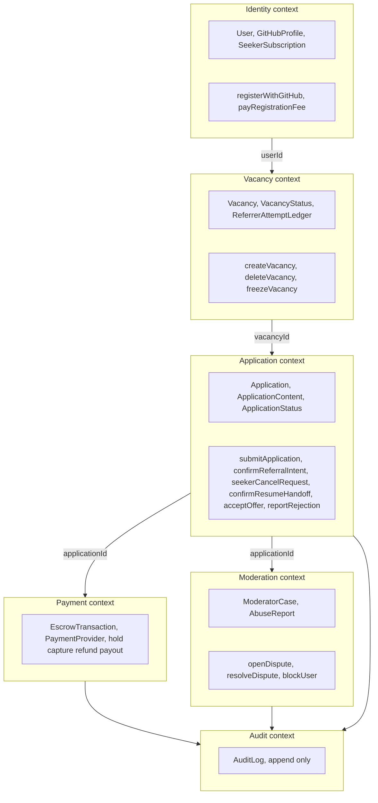
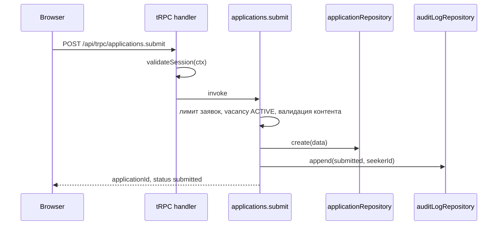
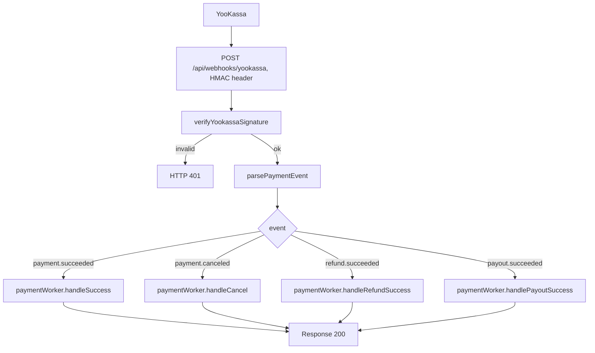
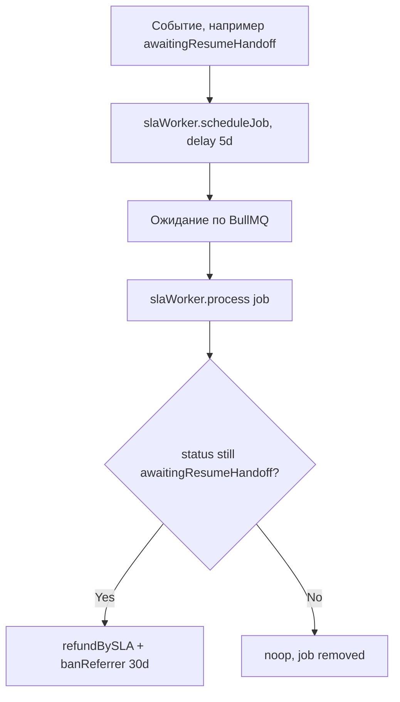

# Introduction

Данная спецификация описывает высокоуровневую архитектуру системы Referi: разбивку на модули, bounded contexts, потоки данных и принципы взаимодействия компонентов. Документ является основным референсом для всех остальных технических спецификаций.

## 1. Purpose & Scope

**Назначение**: зафиксировать архитектурные решения, границы ответственности каждого компонента и правила их взаимодействия.

**Область применения**: вся серверная и клиентская часть приложения Referi версии 1.0.

**Аудитория**: инженеры, AI-агенты, генерирующие код по этой спецификации.

**Допущения**:
- Единственная среда исполнения — веб-браузер + Node.js сервер.
- Мобильное приложение в рамках v1.0 не предусмотрено.
- Монолитная архитектура с логическим разделением на модули (modular monolith).

---

## 2. Definitions

| Термин          | Определение                                                           |
| --------------- | --------------------------------------------------------------------- |
| **Seeker**      | Пользователь в роли соискателя работы                                 |
| **Referrer**    | Пользователь в роли сотрудника компании, размещающего вакансию        |
| **Moderator**   | Сотрудник Referi, разрешающий споры                                   |
| **Application** | Заявка соискателя на конкретную вакансию                              |
| **Vacancy**     | Объявление о вакансии, созданное реферальщиком                        |
| **Escrow**      | Защищённая оплата по заявке: удержание средств у **ЮKassa** (безопасная сделка), синхронизируемое с состоянием заявки |
| **SLA**         | Service Level Agreement — обязательный срок выполнения действия       |
| **Attempt**     | Единица из глобального пула попыток реферальщика (макс. 3)            |
| **BullMQ Job**  | Фоновая задача с отложенным запуском для SLA-таймеров                 |
| **tRPC**        | Type-safe RPC фреймворк, работающий поверх HTTP                       |
| **RSC**         | React Server Components                                               |
| **AuditLog**    | Неизменяемая запись о переходе состояния                              |

---

## 3. Requirements, Constraints & Guidelines

- **REQ-001**: Приложение — единое Next.js приложение (App Router; текущая ветка — Next 16+).
- **REQ-002**: Вся бизнес-логика серверная; клиент получает данные через tRPC или RSC.
- **REQ-003**: Все денежные суммы хранятся в базе данных как целые числа (копейки, `BigInt`); конвертация в рубли происходит только в слое представления.
- **REQ-004**: Каждый переход состояния `Application` должен создавать запись в `AuditLog`.
- **REQ-005**: Вся аутентификация происходит через Auth.js v5; прямые вызовы GitHub API для age-check происходят на сервере, не в браузере.
- **CON-001**: Хранение файлов резюме запрещено. Сервис хранит только текстовые данные (контакты, биография, cover letter).
- **CON-002**: Карточные данные пользователей никогда не поступают на серверы Referi (только через ЮКасса hosted fields / redirect).
- **CON-003**: Максимальное время ответа API на запросы ленты вакансий — 500 мс при нагрузке 100 rps.
- **SEC-001**: Входящий вебхук ЮKassa верифицируется (Basic Auth при реальных платежах; см. [`src/app/api/webhooks/yookassa/route.ts`](../src/app/api/webhooks/yookassa/route.ts)).
- **SEC-002**: Контактная информация соискателя должна быть доступна только авторизованному реферальщику данной вакансии, и только если заявка находится в активном статусе (не `cancelled`, не `rejected*`, не `refunded*`).
- **GUD-001**: Новые модули должны следовать структуре директорий, описанной в разделе 4.
- **PAT-001**: Паттерн Repository — вынесен в `src/server/repositories/*.ts` для повторяющихся запросов; роутеры и команды могут использовать Prisma напрямую там, где слой репозитория ещё не введён.
- **PAT-002**: Паттерн Command — нетривиальные переходы `Application` и связанные транзакции — в `src/server/commands/*.ts`; часть переходов и уведомлений реализована в tRPC-процедурах (`applications.ts`, `moderation.ts`).

---

## 4. Interfaces & Data Contracts

### 4.1 Структура директорий

```
referi/
├── src/
│   ├── app/                         # Next.js App Router pages & layouts
│   │   ├── (public)/                # Публичные маршруты (лента вакансий)
│   │   ├── (auth)/                  # Страницы авторизации
│   │   ├── dashboard/               # Личный кабинет (seeker / referrer)
│   │   ├── admin/                   # Admin-панель (только модераторы/админы)
│   │   └── api/
│   │       ├── trpc/[trpc]/route.ts # tRPC handler
│   │       ├── auth/[...nextauth]/  # Auth.js handler
│   │       ├── webhooks/
│   │       │   └── yookassa/        # POST /api/webhooks/yookassa
│   │       └── cron/                # Служебные endpoints для Railway Cron
│   ├── server/
│   │   ├── trpc/                    # tRPC router definitions
│   │   │   ├── routers/
│   │   │   │   ├── auth.ts
│   │   │   │   ├── vacancies.ts
│   │   │   │   ├── applications.ts
│   │   │   │   ├── payments.ts
│   │   │   │   ├── subscriptions.ts
│   │   │   │   └── moderation.ts    # + export reportsRouter
│   │   │   ├── context.ts           # tRPC context (session, db, ip)
│   │   │   ├── trpc.ts              # protectedProcedure, moderatorProcedure, superjson
│   │   │   └── root.ts              # AppRouter
│   │   ├── repositories/            # PAT-001 (частичное покрытие)
│   │   │   ├── vacancyRepository.ts
│   │   │   ├── applicationRepository.ts
│   │   │   ├── referrerAttemptRepository.ts
│   │   │   └── auditLogRepository.ts
│   │   ├── commands/                # Команды переходов (PAT-002)
│   │   │   ├── confirmReferralIntent.ts
│   │   │   ├── confirmResumeHandoff.ts
│   │   │   ├── acceptOffer.ts
│   │   │   ├── seekerRequestCancel.ts
│   │   │   └── submitApplication.ts
│   │   ├── services/
│   │   │   ├── paymentService.ts    # Абстракция PaymentProvider
│   │   │   └── githubService.ts     # GitHub REST (age-check)
│   │   └── workers/                 # BullMQ jobs
│   │       ├── slaWorker.ts
│   │       └── paymentWorker.ts     # в т.ч. регенерация попыток по расписанию очереди
│   ├── shared/
│   │   ├── constants/
│   │   │   └── businessRules.ts     # Все SLA, лимиты, тарифы
│   │   ├── types/
│   │   │   ├── applicationStatus.ts # ApplicationStatus enum
│   │   │   └── vacancyStatus.ts     # VacancyStatus enum
│   │   └── utils/
│   │       └── money.ts             # Конвертация копеек ↔ рубли
│   ├── components/                  # Переиспользуемые UI-компоненты; оболочка навигации — [spec-ui-shell.md](spec-ui-shell.md)
│   └── lib/
│       ├── prisma.ts                # Prisma Client singleton
│       ├── redis.ts                 # Redis/BullMQ client
│       ├── rateLimiter.ts           # Redis rate limits (tRPC handler)
│       └── auth.ts                  # Auth.js config
├── prisma/
│   ├── schema.prisma
│   └── migrations/
├── prisma.config.ts                 # Prisma 7: datasource URL, путь к миграциям
├── tests/
│   ├── unit/
│   ├── integration/
│   └── e2e/
├── docker-compose.yml
├── docker-compose.prod.yml
└── .github/workflows/
    ├── ci.yml
    └── deploy.yml
```

### 4.2 Bounded Contexts



### 4.3 Request Flow — Типовой запрос (пример: `submitApplication`)



### 4.4 Webhook Flow — ЮКасса



При **невалидной** подписи — `401`, тело не обрабатывается. При **валидной** — ответ `200` после маршрутизации в `paymentWorker` (как в оригинальной спецификации).

### 4.5 SLA Timer Flow — BullMQ



---

## 5. Acceptance Criteria

- **AC-001**: Given запрос к `/api/trpc/vacancies.list`, When в БД 1000 активных вакансий, Then ответ возвращается за ≤ 500 мс.
- **AC-002**: Given вебхук от ЮКассы с невалидной подписью, When система получает запрос, Then возвращает HTTP 401 и не изменяет состояние БД.
- **AC-003**: Given вебхук от ЮКассы с валидной подписью `payment.succeeded`, When соответствующий платёж найден в БД, Then статус `Application` переходит в `awaitingResumeHandoff` и создаётся запись в `AuditLog`.
- **AC-004**: Given реферальщик запрашивает контакты соискателя по чужой заявке, When система проверяет права, Then возвращает HTTP 403.
- **AC-005**: Given BullMQ worker перезапустился, When в очереди есть jobs с уникальными jobId, Then дублирующих переходов состояний не происходит.
- **AC-006**: Given нетривиальный переход `Application`, When выполняется команда в `src/server/commands/*.ts`, Then используется транзакция Prisma и запись в `AuditLog`; репозитории — по мере введения, прямой `ctx.db` / Prisma в tRPC допустим для остальных операций.

---

## 6. Test Automation Strategy

- **Unit-тесты** (Vitest): команды (`src/server/commands/*.ts`) и guard-ы роутеров; моки Prisma или репозиториев по месту.
- **Integration-тесты** (Vitest + testcontainers): репозитории тестируются на реальной Postgres-БД в контейнере.
- **Property-based тесты** (fast-check): машина состояний Application — генерация случайных последовательностей действий и проверка инвариантов.
- **E2E-тесты** (Playwright): ключевые user journeys (регистрация, создание вакансии, полный цикл заявки).
- **Webhook-тесты**: мок-сервер ЮКассы, тест обработки `payment.succeeded` / `refund.succeeded`.
- **Coverage**: целевой минимум для `src/server/commands/` и `src/server/services/` задаётся в CI по мере роста проекта.

---

## 7. Rationale & Context

**Monorepo, не микросервисы**: монолитное приложение Next.js снижает операционную сложность на старте. Разделение на bounded contexts в коде позволяет выделить сервисы позже без переписывания логики.

**tRPC вместо REST**: полная типобезопасность между клиентом и сервером устраняет целый класс ошибок рассогласования контрактов без кодогенерации.

**BullMQ для SLA**: Redis — надёжное хранилище с персистентностью (AOF/RDB). Уникальные `jobId` обеспечивают идемпотентность при рестартах.

**Prisma**: декларативная schema как source of truth для типов и БД одновременно.

---

## 8. Dependencies & External Integrations

### External Systems
- **EXT-001**: GitHub REST API v3 — OAuth аутентификация + чтение `user.created_at` для age-check.

### Third-Party Services
- **SVC-001**: ЮKassa **безопасная сделка (Safe deal)** — сделки между заказчиком и исполнителем, удержание, [возвраты](https://yookassa.ru/developers/solutions-for-platforms/safe-deal/integration/refunds), выплата исполнителю; обычные платежи — через Payments API. SLA ответа API ≤ 3 с.
- **SVC-002**: ЮKassa Payouts API — выплаты на карты и поддерживаемые способы в составе сделки и отдельные сценарии.
- **SVC-003**: Публичная ссылка контакта модерации (`NEXT_PUBLIC_MODERATION_CONTACT_URL`) — только клиентский UI, без серверной интеграции с мессенджерами; см. [spec-moderation-contact.md](spec-moderation-contact.md).

### Infrastructure Dependencies
- **INF-001**: PostgreSQL 16 — основная реляционная БД.
- **INF-002**: Redis 7+ — хранилище очередей BullMQ, кэш сессий.
- **INF-003**: Node.js 20+ LTS — среда исполнения сервера.
- **CFG-001**: Конфигурация окружения валидируется в [`src/env.ts`](../src/env.ts) (Zod) при первом импорте модуля; отсутствие или неверный формат обязательных переменных — немедленная ошибка (fail-fast). Контракт переменных — [`.env.example`](../.env.example). Тот же модуль подключает [`next.config.ts`](../next.config.ts) для полей Sentry при сборке; для клиентского бандла без секретов — [`src/publicEnv.ts`](../src/publicEnv.ts). `sentry.client.config.ts` / `sentry.edge.config.ts` остаются на `process.env` (ограничения Edge/браузера).

### Technology Platform Dependencies
- **PLT-001**: Next.js с App Router (текущая ветка — 16.x); закреплять major-версию в `package.json`.
- **PLT-002**: Auth.js v5 — несовместим с Auth.js v4; использовать только v5 API.

### Compliance Dependencies
- **COM-001**: ФЗ «О персональных данных» (152-ФЗ) — данные пользователей (контакты) должны храниться на серверах в РФ.
- **COM-002**: Referi выступает как маркетплейс; денежный поток по заявкам идёт через договор с ЮKassa (Safe deal и связанные продукты). Юридическое и бухгалтерское сопровождение — с учётом условий подключения и оферты провайдера.

---

## 9. Examples & Edge Cases

### Edge Case: Гонка состояний при подтверждении реферальщика

```typescript
// src/server/commands/confirmReferralIntent.ts (псевдокод / ориентир по слоям)
export async function confirmReferralIntent(
  applicationId: string,
  referrerId: string
): Promise<Application> {
  // Pessimistic lock: SELECT ... FOR UPDATE
  const application = await applicationRepository.findByIdForUpdate(applicationId);

  // Guards
  if (application.status !== "SUBMITTED") {
    throw new BusinessError("APPLICATION_WRONG_STATUS");
  }
  if (application.vacancy.referrerId !== referrerId) {
    throw new ForbiddenError();
  }
  const attempts = await referrerAttemptRepository.getAvailable(referrerId);
  if (attempts <= 0) {
    throw new BusinessError("NO_ATTEMPTS_LEFT");
  }
  const activeReviews = await applicationRepository.countActiveReviewsByReferrer(referrerId);
  if (activeReviews >= 1) {
    throw new BusinessError("ACTIVE_REVIEW_LIMIT_REACHED");
  }

  // Transition
  await referrerAttemptRepository.consume(referrerId, applicationId);
  const updated = await applicationRepository.updateStatus(applicationId, "AWAITING_PAYMENT");
  await auditLogRepository.append({
    applicationId,
    toStatus: "AWAITING_PAYMENT",
    actor: referrerId,
  });

  return updated;
}
```

### Edge Case: Ручное удаление вакансии с активными заявками

```typescript
// Удаление вакансии: логика в src/server/trpc/routers/vacancies.ts (транзакция + refund)
// Должен выполняться в транзакции:
// 1. Получить все активные заявки по вакансии (FOR UPDATE)
// 2. Для каждой: если есть активное удержание по заявке → инициировать refund в ЮKassa
// 3. Перевести все заявки в refundedByVacancyDeleted
// 4. НЕ уменьшать attempt_ledger (ручное удаление — не наказание)
// 5. Обновить статус вакансии на DELETED
// 6. Создать AuditLog записи для каждой затронутой заявки
```

---

## 10. Validation Criteria

1. Структура директорий соответствует схеме в разделе 4.1.
2. Мутации состояния заявок и эскроу не обходят бизнес-guard-ы (команды или процедуры с транзакциями и `AuditLog`).
3. Основные переходы `ApplicationStatus` реализованы в `src/server/commands/*.ts` и/или в `src/server/trpc/routers/applications.ts` согласно [spec-process-application-lifecycle.md](spec-process-application-lifecycle.md).
4. Все денежные операции используют тип `BigInt` для суммы в копейках.
5. Все вебхуки имеют тест на невалидную подпись (ожидаемый результат: 401).

---

## 11. Related Specifications

- [spec-schema-database.md](spec-schema-database.md) — схема БД
- [spec-process-application-lifecycle.md](spec-process-application-lifecycle.md) — машина состояний заявки
- [spec-process-referrer-sla.md](spec-process-referrer-sla.md) — SLA и санкции
- [spec-data-payments-escrow.md](spec-data-payments-escrow.md) — платежи и безопасная сделка ЮKassa
- [spec-design-api.md](spec-design-api.md) — API контракты
- [spec-tool-github-auth.md](spec-tool-github-auth.md) — GitHub OAuth
- [spec-moderation-contact.md](spec-moderation-contact.md) — контакт модерации в UI
