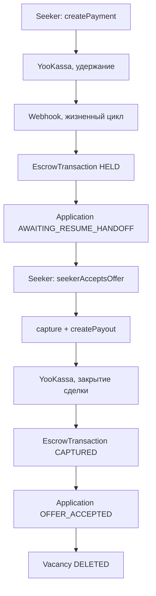
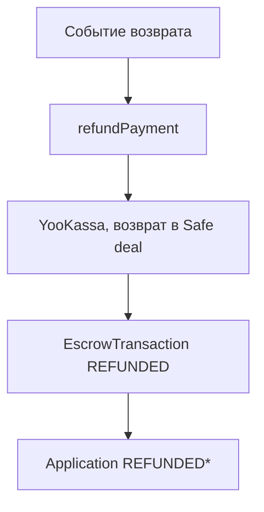
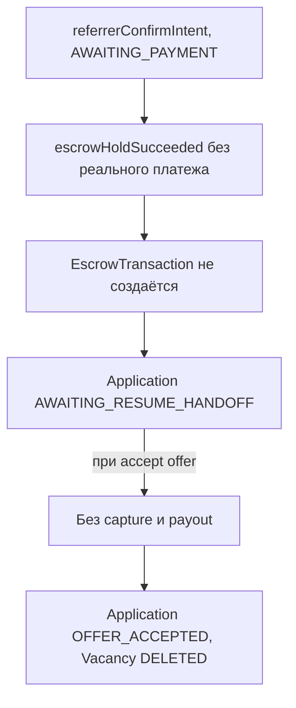

# Introduction

Данная спецификация описывает абстракцию `PaymentProvider`, денежные потоки по заявкам через **безопасную сделку ЮKassa (Safe deal)**, правила идемпотентности, схему webhook-событий и алгоритм расчёта комиссии. Регистрация, подписка «Соискатель PRO» и разовые токены отклика остаются **обычными платежами** вне Safe deal.

**Целевая модель**: средства по заявке с ненулевым вознаграждением не проходят через расчётный счёт Referi как полный объём сделки; удержание и расчёты с заказчиком и исполнителем выполняет ЮKassa по [правилам Safe deal](https://yookassa.ru/developers/solutions-for-platforms/safe-deal/basics). Маркетинговая страница [yookassa.ru/secure-deal](https://yookassa.ru/secure-deal/) допускает иные формулировки сроков и условий подключения; **источник истины для интеграции — раздел Developers** (в API срок жизни сделки от 1 до 180 дней; при истечении без выплаты исполнителю или без возврата сделка закрывается автоматически в пользу возврата заказчику).

**Состояние реализации**: HTTP-слой использует эндпоинты Safe deal (`/deals`, платежи и возвраты с `deal.id`, выплаты исполнителю с привязкой к сделке). Регистрация, подписка PRO и разовый токен отклика остаются обычными платежами Payments API.

---

## 1. Purpose & Scope

**Назначение**: определить стабильные контракты платёжного уровня приложения для Safe deal по заявкам без дублирующих «временных» веток capture-only.

**Аудитория**: инженеры, AI-агенты, QA.

**Допущения**:
- Первичный и единственный провайдер в v1.0 — **ЮKassa** (платёжный шлюз, безопасная сделка для заявок, выплаты исполнителю).
- В тестовом окружении используется `MockPaymentProvider` с тем же интерфейсом.
- Все суммы передаются в **копейках** (`bigint`). Конвертация в рубли — только в слое представления.
- В целевой модели Safe deal заказчик платит, ЮKassa удерживает сумму на своей стороне до подтверждения условий на площадке, затем перечисляет вознаграждение исполнителю или возвращает заказчику.

---

## 2. Definitions

| Термин              | Определение                                                                           |
| ------------------- | ------------------------------------------------------------------------------------- |
| **Safe deal**       | Продукт ЮKassa для маркетплейсов: связка операций «оплата заказчика → удержание → выплата исполнителю или возврат», комиссия маркетплейса по договору |
| **Сделка (deal)**   | Объект жизненного цикла в API ЮKassa с настраиваемым сроком (1–180 суток по документации API) |
| **Заказчик**        | Соискатель, вносящий оплату по заявке                                                 |
| **Исполнитель**     | Реферальщик, получающий вознаграждение после выполнения условий сделки на платформе   |
| **Холд (Hold)**     | Удержание средств заказчика в сделке Safe deal до выполнения условий на платформе |
| **Capture**         | Технический термин Payments API; в контексте Safe deal используется только где требует сценарий API, основной расчёт ведётся через операции сделки |
| **Refund**          | Возврат заказчику в рамках отмены сделки или спора                                    |
| **Payout**          | Выплата вознаграждения исполнителю на карту или иной поддерживаемый способ            |
| **Escrow (продукт)**| Защищённая оплата по заявке: деньги у **провайдера**, не на отдельном эскроу-счёте Referi |
| **EscrowTransaction**| Запись в БД Referi — зеркало состояния платежа/сделки по заявке у ЮKassa               |
| **Idempotency Key** | Уникальный ключ запроса; повторный запрос с тем же ключом возвращает тот же результат |
| **Webhook**         | HTTP POST-уведомление от ЮKassa об изменении статуса платежа или сделки              |
| **netPayout**       | Сумма к выплате исполнителю: `amount - commission`                                    |

---

## 3. Requirements, Constraints & Guidelines

- **REQ-001**: `PaymentProvider` — TypeScript-интерфейс. Все операции с деньгами по заявке идут только через него.
- **REQ-002**: Каждый вызов `PaymentProvider` должен сопровождаться уникальным `idempotencyKey` в формате `{operation}:{entityId}:{attemptNumber}`.
- **REQ-003**: `EscrowTransaction.amountKopecks` устанавливается при создании и не изменяется.
- **REQ-004**: `capture` и `payout` должны выполняться только если `EscrowTransaction.status = HELD` (или эквивалентное разрешение в API сделки после успешной оплаты заказчика).
- **REQ-005**: `refund` должен выполняться только если сделка не закрыта в пользу исполнителя (`EscrowTransaction.status = HELD` в упрощённой модели, не `CAPTURED`).
- **REQ-006**: Webhook-обработчик возвращает HTTP 200 OK даже при повторном получении уже обработанного события (идемпотентность).
- **REQ-007**: Комиссия сервиса рассчитывается по формуле: `commission = floor(amount * PLATFORM_COMMISSION_RATE)`. Округление — вниз (в пользу исполнителя).
- **CON-001**: Referi не хранит данные банковских карт. Реквизиты исполнителя для выплат обрабатываются ЮKassa; Referi хранит только ссылочные идентификаторы (`savedPaymentMethodId` и аналоги).
- **CON-002**: Выплата исполнителю невозможна без предварительно добавленного способа получения. Исполнитель обязан добавить способ выплат до получения первого вознаграждения по заявке.
- **SEC-001**: Webhook-запросы от ЮKassa должны верифицироваться по HMAC-SHA256 подписи в заголовке `Authorization`.
- **GUD-001**: Все платёжные операции оборачиваются в try/catch; при ошибке создаётся BullMQ retry job.

---

## 4. Interfaces & Data Contracts

### 4.1 Интерфейс PaymentProvider

Абстракция сохраняет знакомые операции приложения; при миграции на Safe deal тела запросов к ЮKassa переходят на [эндпоинты сделок и связанных платежей](https://yookassa.ru/developers/solutions-for-platforms/safe-deal/integration/payments), а `capturePayment` / `createPayout` отображаются на закрытие сделки и выплату исполнителю.

```typescript
// src/server/services/paymentService.ts

export interface CreatePaymentOptions {
  idempotencyKey: string;
  amountKopecks: bigint;
  description: string;
  metadata: {
    applicationId: string;
    seekerId: string;
  };
  capture: false;  // для заявок: удержание до подтверждения условий (холд или эквивалент в сделке)
  returnUrl: string;
}

export interface CreatePaymentResult {
  paymentId: string;
  confirmationUrl: string;
  status: 'pending';
}

export interface CaptureOptions {
  idempotencyKey: string;
  paymentId: string;
  amountKopecks: bigint;
}

export interface RefundOptions {
  idempotencyKey: string;
  paymentId: string;
  amountKopecks: bigint;
  description: string;
}

export interface RefundResult {
  refundId: string;
  status: 'succeeded' | 'pending';
}

export interface PayoutOptions {
  idempotencyKey: string;
  amountKopecks: bigint;
  description: string;
  savedPaymentMethodId: string;
  metadata: { referrerId: string; applicationId: string };
}

export interface PayoutResult {
  payoutId: string;
  status: 'pending' | 'succeeded';
}

export interface PaymentProvider {
  /**
   * Создаёт оплату заказчика по заявке (в Safe deal — платёж в составе сделки).
   */
  createPayment(options: CreatePaymentOptions): Promise<CreatePaymentResult>;

  /**
   * Подтверждает списание в пользу сценария выплаты исполнителю (в Safe deal — шаг согласованный с API сделки).
   */
  capturePayment(options: CaptureOptions): Promise<void>;

  /**
   * Возвращает средства заказчику при отмене условий сделки.
   */
  refundPayment(options: RefundOptions): Promise<RefundResult>;

  /**
   * Выплачивает вознаграждение исполнителю после успешного завершения сделки с точки зрения платформы.
   */
  createPayout(options: PayoutOptions): Promise<PayoutResult>;

  /**
   * Проверяет актуальный статус платежа в ЮKassa (polling fallback).
   */
  getPaymentStatus(paymentId: string): Promise<'pending' | 'waiting_for_capture' | 'succeeded' | 'canceled'>;
}
```

### 4.2 Полный денежный поток (безопасная сделка)

Пользовательский сценарий ЮKassa:

1. Заказчик и исполнитель участвуют в сделке на платформе Referi.
2. Заказчик оплачивает согласованную сумму.
3. ЮKassa удерживает платёж на своей стороне на срок жизни сделки.
4. Исполнитель выполняет обязательства (передача резюме и далее по жизненному циклу заявки).
5. На платформе фиксируется исход (например, принятие оффера или возвратные статусы).
6. При успехе — перечисление исполнителю; при срыве условий — возврат заказчику.

Сопоставление с состояниями заявки Referi:

**Сценарий A: успешный оффер**



**Сценарий B: возврат (SLA, cancel, модератор)**



**Сценарий C: бесплатный реферал, amount 0**



### 4.3 Webhook-события ЮKassa

До миграции на отдельные объекты сделки основной поток опирается на события платежа. После миграции в обработчик добавляются события жизненного цикла сделки согласно [документации](https://yookassa.ru/developers/solutions-for-platforms/safe-deal/basics).

| Событие                       | Триггер                             | Действие в системе                                |
| ----------------------------- | ----------------------------------- | ------------------------------------------------- |
| `payment.waiting_for_capture` | Успешная оплата при двухстадийном платеже | `escrowHoldSucceeded(applicationId)`              |
| `payment.succeeded`           | Списание подтверждено               | Обновить `EscrowTransaction.capturedAt`           |
| `payment.canceled`            | Платёж отменён или истёк            | `paymentDeadlineExpired(applicationId)` при релевантности |
| `refund.succeeded`            | Возврат заказчику выполнен          | Обновить `EscrowTransaction.refundedAt`           |
| `payout.succeeded`            | Выплата исполнителю выполнена       | Обновить `EscrowTransaction.payoutId` + уведомить |
| `payout.canceled`             | Выплата не выполнена                | Создать retry job; уведомить модератора           |

### 4.4 Обработка webhook (псевдокод)

```typescript
// app/api/webhooks/yookassa/route.ts

export async function POST(request: Request) {
  const body = await request.text();
  const authHeader = request.headers.get('Authorization');
  if (!verifyYookassaSignature(body, authHeader)) {
    return new Response('Unauthorized', { status: 401 });
  }

  const event = JSON.parse(body) as YookassaWebhookEvent;

  const alreadyProcessed = await isWebhookProcessed(event.object.id, event.event);
  if (alreadyProcessed) {
    return new Response('OK', { status: 200 });
  }

  await paymentWorkerQueue.add('handle-webhook', { event }, {
    jobId: `webhook:${event.event}:${event.object.id}`,
    attempts: 5,
    backoff: { type: 'exponential', delay: 2000 },
  });

  return new Response('OK', { status: 200 });
}
```

### 4.5 Расчёт комиссии

Комиссия Referi как маркетплейса задаётся бизнес-правилами; зачисление на расчётный счёт магазина и удержание НДС/комиссии эквайера — по договору с ЮKassa.

```typescript
// shared/utils/money.ts

export function calculateCommission(amountKopecks: bigint): {
  commission: bigint;
  netPayout: bigint;
} {
  const RATE = BigInt(Math.round(BUSINESS_RULES.PLATFORM_COMMISSION_RATE * 10000));
  const commission = (amountKopecks * RATE) / BigInt(10000);
  const netPayout = amountKopecks - commission;
  return { commission, netPayout };
}
```

### 4.6 Polling fallback при задержке webhook

```typescript
// src/server/workers/paymentWorker.ts

async function schedulePaymentPolling(applicationId: string, paymentId: string) {
  await paymentPollingQueue.add('poll-payment', { applicationId, paymentId }, {
    jobId: `poll:${paymentId}`,
    delay: 5 * 60 * 1000,
    attempts: 12,
    backoff: { type: 'fixed', delay: 5 * 60 * 1000 },
  });
}

async function cancelPollingJob(paymentId: string) {
  const job = await paymentPollingQueue.getJob(`poll:${paymentId}`);
  if (job) await job.remove();
}
```

---

## 5. Acceptance Criteria

- **AC-001**: Given вызов `createPayment` с одним `idempotencyKey` дважды, When второй вызов приходит, Then возвращается тот же `paymentId` без дубля у провайдера.
- **AC-002**: Given webhook подтверждения удержания оплаты по `applicationId`, When он получен, Then `EscrowTransaction` создаётся со статусом `HELD` и `Application` переходит в `AWAITING_RESUME_HANDOFF`.
- **AC-003**: Given тот же webhook получен повторно, When обработчик проверяет идемпотентность, Then возвращает 200 OK без повторного изменения БД.
- **AC-004**: Given `seekerAcceptsOffer` вызван, When `EscrowTransaction.status = HELD`, Then последовательно выполняются шаги списания/закрытия в пользу выплаты и `createPayout`; `EscrowTransaction.status = CAPTURED`.
- **AC-005**: Given вебхук с невалидной подписью, When система его получает, Then возвращает 401 и не изменяет БД.
- **AC-006**: Given `rewardKopecks = 0` для вакансии, When вызывается `escrowHoldSucceeded`, Then `EscrowTransaction` не создаётся и `capture`/`payout` не вызываются при `offerAccepted`.
- **AC-007**: Given `payout.canceled` webhook получен, When система обрабатывает его, Then создаётся retry BullMQ job и уведомляется модератор.
- **AC-008**: Given `calculateCommission(10_000_00n)`, When вычисляется, Then `commission = 1_000_00n` и `netPayout = 9_000_00n`.

---

## 6. Test Automation Strategy

- **Unit-тесты**: `MockPaymentProvider` реализует тот же интерфейс; все команды тестируются с мок-провайдером.
- **Integration-тесты**: тестовая среда ЮKassa (sandbox) для проверки flow Safe deal после включения в интеграции.
- **Webhook-тесты**: генерация валидных и невалидных подписей; идемпотентность при повторном получении.
- **Money-тесты**: `calculateCommission` на граничных значениях (0, 1 коп., большие суммы).

---

## 7. Rationale & Context

**Safe deal**: снимает с Referi необходимость вести собственный эскроу-счёт; удержание и возвраты выполняет лицензированный провайдер; бухгалтерия упрощается за счёт зачисления на счёт магазина в основном комиссии маркетплейса (по условиям договора с ЮKassa).

**Срок сделки**: максимум 180 суток по API; при проектировании SLA заявки (`awaitingCompanyDecision` и др.) нужно укладываться в горизонт сделки или договариваться о продлении/новой сделке с менеджером ЮKassa.

**Webhook в очередь**: асинхронная обработка через BullMQ с retry предотвращает потерю событий при временных ошибках БД.

**Абстракция PaymentProvider**: изолирует HTTP-детали ЮKassa и позволяет сменить реализацию на полный Safe deal без изменения команд заявки.

**BigInt везде**: точность сумм в копейках для крупных вознаграждений.

---

## 8. Dependencies & External Integrations

- **SVC-001**: [Safe deal — основы](https://yookassa.ru/developers/solutions-for-platforms/safe-deal/basics).
- **SVC-002**: [Приём платежей в Safe deal](https://yookassa.ru/developers/solutions-for-platforms/safe-deal/integration/payments).
- **SVC-003**: [Возвраты в Safe deal](https://yookassa.ru/developers/solutions-for-platforms/safe-deal/integration/refunds).
- **SVC-004**: Выплаты исполнителю и лимиты — разделы Payouts в документации ЮKassa для сценария маркетплейса.
- **SVC-005**: [ЮKassa Payments API v3](https://api.yookassa.ru/v3/payments) — обычные платежи (регистрация, подписка, токены отклика).
- **INF-001**: Redis + BullMQ — очередь обработки webhook-событий.

Продуктовая справка и условия подключения: [Безопасная сделка](https://yookassa.ru/secure-deal/) (в т.ч. ориентиры по обороту и работе через менеджера).

---

## 9. Examples & Edge Cases

### Edge Case: Закрытие сделки при гонке с удалением вакансии

```
Хронология:
  T0: seekerAcceptsOffer() — инициировано закрытие в пользу исполнителя
  T1: запрос к ЮKassa отправлен
  T2: реферальщик удаляет вакансию (до результата T1)

Ожидаемое поведение:
  - Транзакция Prisma в T2 проверяет Application.status = OFFER_ACCEPTED
  - OFFER_ACCEPTED — терминальный статус → каскад не откатывает успешную выплату
  - Операция с ЮKassa завершается согласно идемпотентности
```

### Edge Case: Полный возврат заказчику

```
Соискатель оплатил 50 000 ₽ = 5_000_000 коп.
  refundPayment(paymentId, 5_000_000n)

Комиссия маркетплейса при полном возврате заказчику не удерживается как прибыльная часть сделки (логика возврата по API Safe deal и договору).
```

---

## 10. Validation Criteria

1. `src/server/services/paymentService.ts` экспортирует интерфейс `PaymentProvider` и реализацию под ЮKassa.
2. `src/server/services/paymentService.ts` экспортирует `MockPaymentProvider` для тестов.
3. Ни один файл вне платёжного сервиса не импортирует SDK ЮKassa напрямую.
4. Все вызовы `createPayment`, `capturePayment`, `refundPayment`, `createPayout` содержат `idempotencyKey`.
5. `calculateCommission` покрыт unit-тестами.
6. Вебхук-роут имеет тест на невалидную подпись (ожидает 401).

---

## 11. Related Specifications

- [spec-process-application-lifecycle.md](spec-process-application-lifecycle.md) — денежные операции как side effects переходов
- [spec-schema-database.md](spec-schema-database.md) — `EscrowTransaction`
- [spec-design-api.md](spec-design-api.md) — вебхук роут `/api/webhooks/yookassa`
