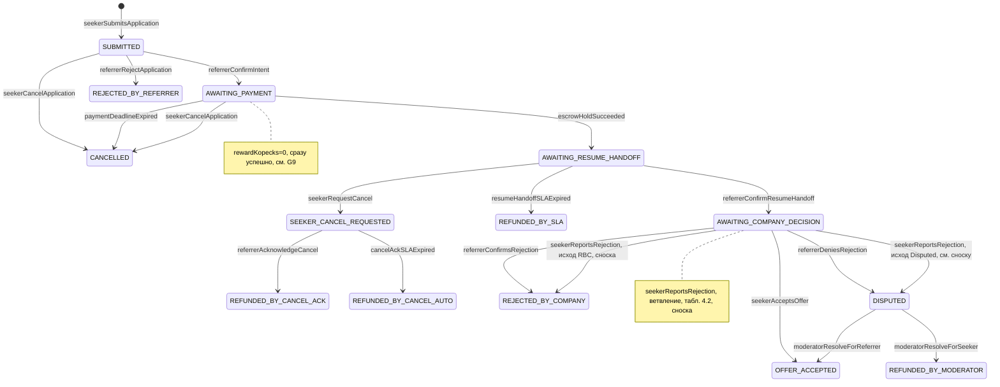

---

## title: Referi — Application Lifecycle State Machine Specification
version: 1.0
date_created: 2026-04-17
owner: Referi Engineering
tags: process, design, app

# Introduction

Данная спецификация определяет полную машину состояний заявки (`Application`) — все состояния, разрешённые переходы, guard-условия и инварианты. Реализация: `src/server/commands/*.ts` и процедуры `[src/server/trpc/routers/applications.ts](../src/server/trpc/routers/applications.ts)` (и связанные воркеры).

## 1. Purpose & Scope

**Назначение**: исчерпывающее описание жизненного цикла заявки соискателя от момента отклика до терминального состояния.

**Аудитория**: инженеры, AI-агенты, QA.

**Допущения**:

- Каждый переход атомарен (выполняется в транзакции БД).
- Каждый переход создаёт запись в `AuditLog`.
- Неразрешённый переход приводит к исключению `BusinessError`.
- Средства по защищённой оплате (зеркало сделки ЮKassa в `EscrowTransaction`) всегда обрабатываются в рамках того же перехода состояния (идемпотентно).

---

## 2. Definitions


| Термин                     | Определение                                                                                 |
| -------------------------- | ------------------------------------------------------------------------------------------- |
| **Терминальное состояние** | Состояние, из которого нет переходов; заявка завершена                                      |
| **Активная заявка**        | Заявка в нетерминальном состоянии; учитывается в лимитах соискателя                         |
| **Guard**                  | Предусловие, которое должно быть истинным для выполнения перехода                           |
| **Command**                | Функция в `src/server/commands/` и/или мутация в `applications` router, выполняющая переход |
| **Actor**                  | Инициатор перехода: `SEEKER`, `REFERRER`, `SYSTEM`, `MODERATOR`                             |


---

## 3. Requirements, Constraints & Guidelines

- **REQ-001**: Нетривиальные переходы (блокировки, списание попыток, эскроу) — в отдельных модулях `src/server/commands/{commandName}.ts`. Простые переходы с записью в `AuditLog` могут быть в `src/server/trpc/routers/applications.ts` (например `cancel`, часть путей после оплаты); новые переходы предпочтительно выносить в команды.
- **REQ-002**: Перед изменением статуса команда должна выполнить `SELECT ... FOR UPDATE` на запись `Application` (пессимистичная блокировка).
- **REQ-003**: Создание `AuditLog`-записи обязательно для каждого перехода.
- **REQ-004**: Все переходы, затрагивающие `EscrowTransaction`, должны выполняться атомарно в одной транзакции Prisma.
- **REQ-005**: Код команд и роутеров не вызывает HTTP провайдеров напрямую из бизнес-слоя без абстракции — только через `src/server/services/*.ts` (платежи, почта).
- **CON-001**: Из терминального состояния переходы запрещены.
- **CON-002**: Нельзя иметь более одной не-терминальной заявки по одной паре `(seekerId, vacancyId)`.
- **GUD-001**: Guard-условия проверяются в строго определённом порядке: сначала статус заявки, затем права актора, затем бизнес-лимиты.

---

## 4. Interfaces & Data Contracts

### 4.1 Полная диаграмма состояний




`[T]` = терминальные состояния: `CANCELLED`, `REJECTED_BY_REFERRER`, `REFUNDED_BY_SLA`, `REFUNDED_BY_CANCEL_ACK`, `REFUNDED_BY_CANCEL_AUTO`, `REJECTED_BY_COMPANY`, `OFFER_ACCEPTED`, `REFUNDED_BY_MODERATOR`, `REFUNDED_BY_VACANCY_DELETED`.

`vacancyDeletedCascade`: из **любого нетерминального** состояния (см. таблицу команд) в `REFUNDED_BY_VACANCY_DELETED` — на диаграмме не все рёбра нарисованы, смысл зафиксирован в табл. 4.2.

Два исхода `seekerReportsRejection` из `AWAITING_COMPANY_DECISION` (стрелки 79–80) соответствуют сноске к табл. 4.2.

### 4.2 Таблица переходов


| Команда                        | Из состояния                    | В состояние                          | Актор     | Guards         |
| ------------------------------ | ------------------------------- | ------------------------------------ | --------- | -------------- |
| `seekerSubmitsApplication`     | — (новая запись)                | `SUBMITTED`                          | SEEKER    | G1, G2, G3     |
| `referrerConfirmIntent`        | `SUBMITTED`                     | `AWAITING_PAYMENT`                   | REFERRER  | G4, G5, G6, G7 |
| `seekerCancelApplication`      | `SUBMITTED`, `AWAITING_PAYMENT` | `CANCELLED`                          | SEEKER    | G8             |
| `referrerRejectApplication`    | `SUBMITTED`                     | `REJECTED_BY_REFERRER`               | REFERRER  | G4             |
| `escrowHoldSucceeded`          | `AWAITING_PAYMENT`              | `AWAITING_RESUME_HANDOFF`            | SYSTEM    | G9             |
| `paymentDeadlineExpired`       | `AWAITING_PAYMENT`              | `CANCELLED`                          | SYSTEM    | G10            |
| `referrerConfirmResumeHandoff` | `AWAITING_RESUME_HANDOFF`       | `AWAITING_COMPANY_DECISION`          | REFERRER  | G4, G11        |
| `resumeHandoffSLAExpired`      | `AWAITING_RESUME_HANDOFF`       | `REFUNDED_BY_SLA`                    | SYSTEM    | G12            |
| `seekerRequestCancel`          | `AWAITING_RESUME_HANDOFF`       | `SEEKER_CANCEL_REQUESTED`            | SEEKER    | G8, G13        |
| `referrerAcknowledgeCancel`    | `SEEKER_CANCEL_REQUESTED`       | `REFUNDED_BY_CANCEL_ACK`             | REFERRER  | G4             |
| `cancelAckSLAExpired`          | `SEEKER_CANCEL_REQUESTED`       | `REFUNDED_BY_CANCEL_AUTO`            | SYSTEM    | G14            |
| `seekerAcceptsOffer`           | `AWAITING_COMPANY_DECISION`     | `OFFER_ACCEPTED`                     | SEEKER    | G8             |
| `seekerReportsRejection`       | `AWAITING_COMPANY_DECISION`     | `DISPUTED` или `REJECTED_BY_COMPANY` | SEEKER    | G8             |
| `referrerConfirmsRejection`    | `AWAITING_COMPANY_DECISION`     | `REJECTED_BY_COMPANY`                | REFERRER  | G4             |
| `referrerDeniesRejection`      | `AWAITING_COMPANY_DECISION`     | `DISPUTED`                           | REFERRER  | G4             |
| `moderatorResolveForReferrer`  | `DISPUTED`                      | `OFFER_ACCEPTED`                     | MODERATOR | G15            |
| `moderatorResolveForSeeker`    | `DISPUTED`                      | `REFUNDED_BY_MODERATOR`              | MODERATOR | G15            |
| `vacancyDeletedCascade`        | любое нетерм.                   | `REFUNDED_BY_VACANCY_DELETED`        | SYSTEM    | —              |


 `seekerReportsRejection`: если реферальщик уже нажал «подтвердить отказ» — `REJECTED_BY_COMPANY`; иначе флаг `seekerReportedRejection = true` и ждём реферальщика.

Имя `escrowHoldSucceeded` — устоявшийся идентификатор перехода; по смыслу это подтверждение успешной оплаты заказчика в **безопасной сделке** ЮKassa (событие после webhook).

### 4.3 Guards (предусловия)


| ID      | Описание                                                                                                                                                                                           |
| ------- | -------------------------------------------------------------------------------------------------------------------------------------------------------------------------------------------------- |
| **G1**  | Пользователь аутентифицирован как автор заявки (`seekerId` совпадает с сессией). Отдельная глобальная роль «соискатель» не требуется.                                                              |
| **G2**  | Количество активных заявок соискателя < лимита (2 бесплатно; 5 с PRO).                                                                                                                             |
| **G3**  | По паре `(seekerId, vacancyId)` нет существующей нетерминальной заявки. Вакансия в статусе `ACTIVE`.                                                                                               |
| **G4**  | Актор является реферальщиком данной вакансии.                                                                                                                                                      |
| **G5**  | Глобальный пул попыток реферальщика > 0.                                                                                                                                                           |
| **G6**  | У реферальщика нет другой заявки в состоянии `AWAITING_PAYMENT`, `AWAITING_RESUME_HANDOFF`, `SEEKER_CANCEL_REQUESTED`, `AWAITING_COMPANY_DECISION` или `DISPUTED` (лимит 1 активное рассмотрение). |
| **G7**  | Заявка в состоянии `SUBMITTED`.                                                                                                                                                                    |
| **G8**  | Актор является соискателем данной заявки.                                                                                                                                                          |
| **G9**  | `EscrowTransaction.yookassaPaymentId` соответствует событию; статус транзакции `HELD`. Или `rewardKopecks = 0` (пропуск оплаты).                                                                   |
| **G10** | Текущее время > `Application.paymentDeadline`. Статус заявки всё ещё `AWAITING_PAYMENT`.                                                                                                           |
| **G11** | Заявка в состоянии `AWAITING_RESUME_HANDOFF`.                                                                                                                                                      |
| **G12** | Текущее время > `Application.resumeHandoffDeadline`. Статус всё ещё `AWAITING_RESUME_HANDOFF`.                                                                                                     |
| **G13** | Заявка в состоянии `AWAITING_RESUME_HANDOFF`. Нет активного `SEEKER_CANCEL_REQUESTED` (уже запрошен).                                                                                              |
| **G14** | Текущее время > `Application.cancelAckDeadline`. Статус всё ещё `SEEKER_CANCEL_REQUESTED`.                                                                                                         |
| **G15** | Актор имеет роль `MODERATOR`. Существует `ModeratorCase` для данной заявки в статусе `OPEN`.                                                                                                       |


### 4.4 Side Effects по переходам


| Переход                        | Side Effects                                                                                                  |
| ------------------------------ | ------------------------------------------------------------------------------------------------------------- |
| `seekerSubmitsApplication`     | Установить `firstApplicationAt` в `Vacancy` если NULL                                                         |
| `referrerConfirmIntent`        | Потратить попытку в `ReferrerAttemptLedger`; запланировать SLA-таймер оплаты; запланировать BullMQ job        |
| `escrowHoldSucceeded`          | Создать `EscrowTransaction` со статусом `HELD`; запланировать SLA-таймер передачи резюме                      |
| `paymentDeadlineExpired`       | Отменить BullMQ job передачи резюме (если был)                                                                |
| `resumeHandoffSLAExpired`      | Инициировать возврат; создать `ReferrerSanction` (бан 30 дней); уведомить обоих                               |
| `seekerRequestCancel`          | Уведомить реферальщика; запланировать cancelAck SLA-таймер                                                    |
| `refundedByCancelAck / Auto`   | Инициировать возврат; освободить слот активного отклика                                                       |
| `referrerConfirmResumeHandoff` | Отменить SLA-таймер передачи резюме; запланировать SLA-таймер решения компании                                |
| `seekerAcceptsOffer`           | Инициировать закрытие сделки в пользу исполнителя (`capture` → выплата); авто-удаление вакансии               |
| `rejectedByCompany`            | Инициировать возврат; освободить слот                                                                         |
| `disputed`                     | Создать `ModeratorCase`; модераторы обрабатывают спор в админ-панели                                          |
| `moderatorResolveForReferrer`  | Инициировать закрытие в пользу исполнителя (`capture` → выплату); закрыть `ModeratorCase`                     |
| `moderatorResolveForSeeker`    | Инициировать возврат; закрыть `ModeratorCase`                                                                 |
| `vacancyDeletedCascade`        | Для заявок с удержанием по сделке — инициировать возврат заказчику; вернуть попытки через `RETURNED` в ledger |


### 4.5 Инварианты (всегда истинны)

1. **INV-001**: Соискатель имеет не более `MAX_ACTIVE_APPLICATIONS` активных заявок.
2. **INV-002**: Реферальщик имеет не более 1 заявки в состояниях `AWAITING_PAYMENT | AWAITING_RESUME_HANDOFF | SEEKER_CANCEL_REQUESTED | AWAITING_COMPANY_DECISION | DISPUTED`.
3. **INV-003**: Глобальный пул попыток реферальщика ∈ [0, 3].
4. **INV-004**: `EscrowTransaction` существует тогда и только тогда, когда `rewardKopecks > 0` и заявка прошла `AWAITING_PAYMENT`.
5. **INV-005**: Из терминального состояния нет исходящих переходов.
6. **INV-006**: Каждый переход имеет ровно одну `AuditLog`-запись.
7. **INV-007**: Если `Application.status = DISPUTED`, существует `ModeratorCase` с `status = OPEN`.

---

## 5. Acceptance Criteria

- **AC-001**: Given соискатель уже имеет 2 активных заявки (бесплатный лимит), When вызывается `seekerSubmitsApplication`, Then выбрасывается `BusinessError('ACTIVE_APPLICATION_LIMIT_REACHED')`.
- **AC-002**: Given реферальщик имеет 0 попыток в пуле, When вызывается `referrerConfirmIntent`, Then выбрасывается `BusinessError('NO_ATTEMPTS_LEFT')`.
- **AC-003**: Given реферальщик уже рассматривает одну заявку (`AWAITING_RESUME_HANDOFF`), When вызывается `referrerConfirmIntent` для другой заявки, Then выбрасывается `BusinessError('ACTIVE_REVIEW_LIMIT_REACHED')`.
- **AC-004**: Given два одновременных вызова `referrerConfirmIntent` для одной заявки, When оба завершаются, Then только один успешен; второй получает `BusinessError('APPLICATION_WRONG_STATUS')`.
- **AC-005**: Given заявка в `AWAITING_RESUME_HANDOFF` и `rewardKopecks = 0`, When создаётся заявка с таким вознаграждением, Then переход `SUBMITTED → AWAITING_PAYMENT → AWAITING_RESUME_HANDOFF` происходит автоматически без платёжного шага.
- **AC-006**: Given `resumeHandoffSLAExpired` срабатывает, When заявка уже перешла в другое состояние (race condition), Then никаких действий не производится (noop).
- **AC-007**: Given соискатель нажал «Получил отказ» и реферальщик опроверг, When вызывается `referrerDeniesRejection`, Then создаётся `ModeratorCase` и отправляется уведомление модераторам.
- **AC-008**: Given вакансия удаляется реферальщиком, When у неё есть заявка в `DISPUTED`, Then удаление отклоняется с ошибкой `VACANCY_HAS_OPEN_DISPUTE`.

---

## 6. Test Automation Strategy

- **Unit-тесты** (Vitest): каждая команда тестируется с мок-репозиториями. Тестовые сценарии: happy path, каждый guard в отдельности, race condition.
- **Property-based тесты** (fast-check): генерация случайных последовательностей допустимых и недопустимых действий; проверка инвариантов INV-001..007 после каждого шага.
- **Integration-тесты**: полный жизненный цикл заявки (от `submitApplication` до `offerAccepted`) на реальной БД.

---

## 7. Rationale & Context

**Пессимистичные блокировки**: для guard-условий типа «не более 1 активного рассмотрения» оптимистичный подход даёт гонки под нагрузкой. `SELECT ... FOR UPDATE` гарантирует консистентность.

**Side effects отдельно от транзакции**: вызовы внешних сервисов (ЮKassa и др.) происходят после успешного коммита транзакции. При сбое внешнего сервиса — повтор через BullMQ.

**Явное разделение seeker/referrer подтверждения отказа**: не используется единый флаг `bothConfirmed`, чтобы было понятно кто именно подтвердил. Каждая сторона меняет поле в `Application` или создаёт отдельное событие в `AuditLog`.

---

## 8. Dependencies & External Integrations

- **spec-schema-database.md** — `ApplicationStatus`, `Application`, `EscrowTransaction`, `ReferrerAttemptLedger`, `AuditLog`.
- **spec-process-referrer-sla.md** — SLA-таймеры, реализующие переходы по истечению дедлайнов.
- **spec-data-payments-escrow.md** — `hold`, `capture`, `refund` вызываются как side effects.

---

## 9. Examples & Edge Cases

### Полный happy path с оплатой

```
1. seekerSubmitsApplication(seekerId, vacancyId, content)
   → status: SUBMITTED
   → AuditLog: { from: null, to: SUBMITTED, actor: SEEKER }

2. referrerConfirmIntent(applicationId, referrerId)
   → status: AWAITING_PAYMENT
   → ReferrerAttemptLedger: { event: CONSUMED }
   → BullMQ: scheduleJob('payment-deadline', applicationId, delay: 5 days)
   → AuditLog: { from: SUBMITTED, to: AWAITING_PAYMENT, actor: REFERRER }

3. [ЮКасса webhook: payment.succeeded]
   escrowHoldSucceeded(applicationId, yookassaPaymentId)
   → EscrowTransaction: { status: HELD, amountKopecks: N }
   → status: AWAITING_RESUME_HANDOFF
   → BullMQ: cancelJob('payment-deadline')
   → BullMQ: scheduleJob('resume-handoff-deadline', applicationId, delay: 5 days)
   → AuditLog: { from: AWAITING_PAYMENT, to: AWAITING_RESUME_HANDOFF, actor: SYSTEM }

4. referrerConfirmResumeHandoff(applicationId, referrerId)
   → status: AWAITING_COMPANY_DECISION
   → BullMQ: cancelJob('resume-handoff-deadline')
   → BullMQ: scheduleJob('company-decision-deadline', applicationId, delay: 30 days)
   → AuditLog: { from: AWAITING_RESUME_HANDOFF, to: AWAITING_COMPANY_DECISION, actor: REFERRER }

5. seekerAcceptsOffer(applicationId, seekerId)
   → status: OFFER_ACCEPTED
   → paymentService.capture(escrowTxId)  [+] paymentService.payout(referrerId, netAmount)
   → vacancy.status = DELETED (авто)
   → AuditLog: { from: AWAITING_COMPANY_DECISION, to: OFFER_ACCEPTED, actor: SEEKER }
```

### Edge Case: бесплатный реферал (`rewardKopecks = 0`)

```
referrerConfirmIntent → AWAITING_PAYMENT
  → escrowHoldSucceeded вызывается системой автоматически (нет платежа)
  → EscrowTransaction НЕ создаётся (сумма 0)
  → status сразу переходит в AWAITING_RESUME_HANDOFF
```

---

## 10. Validation Criteria

1. Все переходы из таблицы 4.2 имеют реализацию в `src/server/commands/*.ts` и/или в `src/server/trpc/routers/applications.ts` (и модерация споров — `moderation.ts`) с записью в `AuditLog` где требуется спека.
2. Команды с конкурентным доступом используют пессимистичную блокировку (`$transaction` + `findUnique` с контекстом блокировки там, где это введено в коде).
3. Unit-тесты покрывают критичные guards для команд и роутеров по мере добавления.
4. Property-based тест не нарушает ни один из инвариантов INV-001..007 за 10 000 итераций (целевой критерий при внедрении PBT).
5. Обновление `Application.status` не выполняется произвольными raw SQL-скриптами вне приложения в рабочем контуре.

---

## 11. Related Specifications

- [spec-schema-database.md](spec-schema-database.md)
- [spec-process-referrer-sla.md](spec-process-referrer-sla.md)
- [spec-data-payments-escrow.md](spec-data-payments-escrow.md)
- [spec-architecture-referi-system.md](spec-architecture-referi-system.md)

