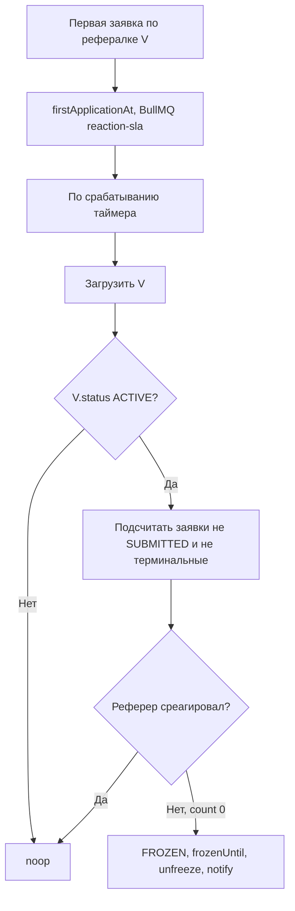
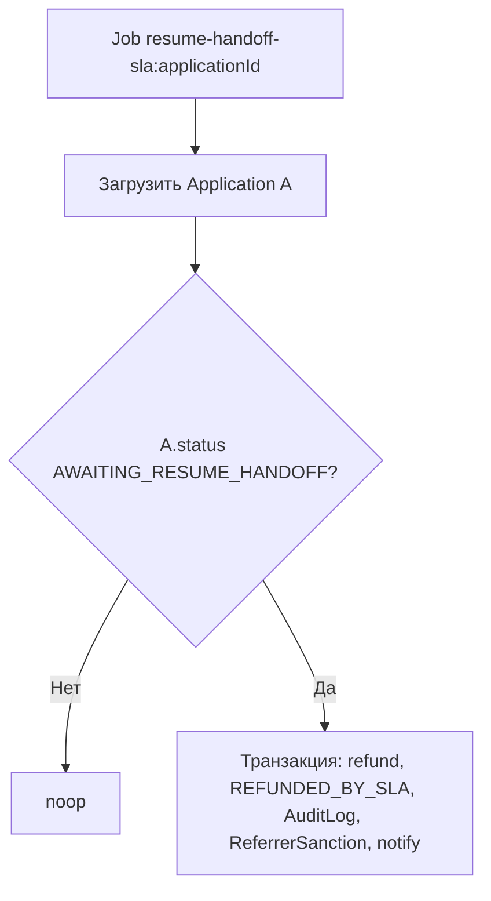
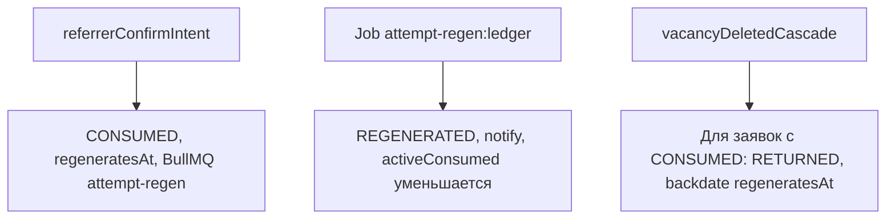

# Introduction

Данная спецификация описывает все SLA-таймеры платформы Referi, механизм санкций для реферальщиков, систему лимитов и глобальный пул попыток реферальщика с 60-дневной регенерацией. Является источником истины для реализации [`src/server/workers/slaWorker.ts`](../src/server/workers/slaWorker.ts) (включая регенерацию попыток и связанные delayed jobs).

## 1. Purpose & Scope

**Назначение**: чётко определить все временны́е ограничения, автоматические действия по их истечении и правила управления пулом попыток реферальщика.

**Аудитория**: инженеры, AI-агенты, QA.

**Допущения**:
- Все тайм-ауты отсчитываются от момента перехода в соответствующее состояние.
- BullMQ используется для отложенных задач (delayed jobs).
- `jobId` каждой задачи уникален и детерминирован (`{type}:{applicationId}`).
- Конфигурационные константы находятся в `src/shared/constants/businessRules.ts`.

---

## 2. Definitions

| Термин                | Определение                                                            |
| --------------------- | ---------------------------------------------------------------------- |
| **SLA**               | Максимально допустимое время выполнения действия участником            |
| **SLA-таймер**        | BullMQ delayed job, запускающийся по истечении SLA                     |
| **Санкция**           | Ограничение, налагаемое на реферальщика при нарушении SLA              |
| **Фриз вакансии**     | Статус `FROZEN` — вакансия скрыта из ленты, новые заявки запрещены    |
| **Бан**               | Запрет брать новых соискателей в рассмотрение на определённый срок     |
| **Попытка (Attempt)** | Единица из глобального пула реферальщика; тратится при `confirmIntent` |
| **Регенерация**       | Автоматическое восстановление попытки через 60 дней после траты        |

---

## 3. Requirements, Constraints & Guidelines

- **REQ-001**: Все конфигурационные значения SLA и санкций хранятся в `src/shared/constants/businessRules.ts` и подключаются в воркерах через `BUSINESS_RULES` (без дублирования чисел в коде).
- **REQ-002**: Каждый BullMQ job имеет уникальный `jobId`. При повторном планировании того же job с тем же `jobId` — идемпотентно (не дублируется).
- **REQ-003**: SLA-воркер перед выполнением действия обязан проверить актуальный статус заявки в БД. Если статус изменился — воркер завершает работу без действий (noop).
- **REQ-004**: Фриз вакансии происходит только если у неё есть хотя бы одна заявка в статусе `SUBMITTED` и реферальщик не взял ни одного за SLA-период.
- **REQ-005**: Регенерация попытки должна быть запланирована в момент траты попытки (не постфактум).
- **REQ-006**: Пул попыток пересчитывается динамически из `ReferrerAttemptLedger`; отдельного кэша не используется.
- **CON-001**: Максимальный пул попыток = 3 (значение из `businessRules.MAX_REFERRER_ATTEMPTS`).
- **CON-002**: Лимиты реферальщика (1 вакансия, 1 рассмотрение, 3 попытки) не расширяются никакой подпиской или оплатой.
- **GUD-001**: BullMQ jobs используют `removeOnComplete: { count: 100 }` и `removeOnFail: { count: 50 }` для очистки истории.

---

## 4. Interfaces & Data Contracts

### 4.1 Конфигурация бизнес-правил

```typescript
// src/shared/constants/businessRules.ts

export const BUSINESS_RULES = {
  // SLA (в миллисекундах)
  SLA_REFERRER_REACTION_MS:    7  * 24 * 60 * 60 * 1000, // 7 дней
  SLA_PAYMENT_DEADLINE_MS:     5  * 24 * 60 * 60 * 1000, // 5 дней
  SLA_RESUME_HANDOFF_MS:       5  * 24 * 60 * 60 * 1000, // 5 дней
  SLA_CANCEL_ACK_MS:           3  * 24 * 60 * 60 * 1000, // 3 дня
  SLA_COMPANY_DECISION_MS:     30 * 24 * 60 * 60 * 1000, // 30 дней

  // Санкции (в миллисекундах)
  SANCTION_RESUME_BAN_MS:      30 * 24 * 60 * 60 * 1000, // 30 дней
  SANCTION_REACTION_FREEZE_MS: 14 * 24 * 60 * 60 * 1000, // 14 дней

  // Попытки
  MAX_REFERRER_ATTEMPTS:       3,
  ATTEMPT_REGENERATION_MS:     60 * 24 * 60 * 60 * 1000, // 60 дней

  // Лимиты соискателя
  FREE_ACTIVE_APPLICATIONS:    2,
  PRO_ACTIVE_APPLICATIONS:     5,

  // Тарифы (в копейках)
  PAID_APPLICATION_PRICE_KOP:  199_00,  // 199 ₽
  PRO_SUBSCRIPTION_PRICE_KOP:  499_00,  // 499 ₽/мес
  PLATFORM_COMMISSION_RATE:    0.10,    // 10%

  // Регистрационный сбор (в копейках, фиксированная сумма в коде)
  REGISTRATION_FEE_KOP:        50_000_00, // 50 000 ₽, фиксированная сумма в бизнес-правилах

  // GitHub age requirement
  GITHUB_ACCOUNT_MIN_AGE_DAYS: 365,
} as const;
```

### 4.2 Полная таблица SLA-таймеров

| Таймер                 | JobId                                  | Запускается при                             | Задержка | Действие при срабатывании                                                  |
| ---------------------- | -------------------------------------- | ------------------------------------------- | -------- | -------------------------------------------------------------------------- |
| `reaction-sla`         | `reaction-sla:{vacancyId}`             | Первая заявка по рефералке                   | 7 дней   | Если нет ни одной заявки вне `SUBMITTED` → заморозить вакансию на 14 дней  |
| `payment-deadline`     | `payment-deadline:{applicationId}`     | Переход в `AWAITING_PAYMENT`                | 5 дней   | Перевести в `CANCELLED`                                                    |
| `resume-handoff-sla`   | `resume-handoff-sla:{applicationId}`   | Переход в `AWAITING_RESUME_HANDOFF`         | 5 дней   | Перевести в `REFUNDED_BY_SLA`; создать `ReferrerSanction` (бан 30 дней)    |
| `cancel-ack-sla`       | `cancel-ack-sla:{applicationId}`       | Переход в `SEEKER_CANCEL_REQUESTED`         | 3 дня    | Перевести в `REFUNDED_BY_CANCEL_AUTO`                                      |
| `company-decision-sla` | `company-decision-sla:{applicationId}` | Переход в `AWAITING_COMPANY_DECISION`       | 30 дней  | Если статус не изменился → перевести в `DISPUTED`; создать `ModeratorCase` |
| `attempt-regeneration` | `attempt-regen:{ledgerEntryId}`        | Запись `CONSUMED` в `ReferrerAttemptLedger` | 60 дней  | Создать запись `REGENERATED` в ledger                                      |

### 4.3 Механика фриза вакансии (reaction-sla)



### 4.4 Механика бана реферальщика (resume-handoff-sla истёк)



### 4.5 Глобальный пул попыток реферальщика

#### Структура подсчёта

```
availableAttempts(referrerId) =
  MAX_REFERRER_ATTEMPTS
  - COUNT(CONSUMED WHERE regeneratesAt > now())  // активные траты
  + COUNT(RETURNED entries for this referrer)     // возвраты при удалении вакансии
```

Точная реализация — через единый запрос к `ReferrerAttemptLedger`:

```typescript
// src/server/repositories/referrerAttemptRepository.ts

async function getAvailableAttempts(referrerId: string): Promise<number> {
  // Считаем "активные" траты: CONSUMED, у которых regeneratesAt ещё в будущем
  // (или вообще null — не должно быть после миграции)
  const activeConsumed = await prisma.referrerAttemptLedger.count({
    where: {
      referrerId,
      event: 'CONSUMED',
      regeneratesAt: { gt: new Date() },
    },
  });

  return Math.max(0, BUSINESS_RULES.MAX_REFERRER_ATTEMPTS - activeConsumed);
}
```

#### Жизненный цикл попытки



Деталь полей `ReferrerAttemptLedger` и `regeneratesAt` — в репозитории и `BUSINESS_RULES` (текст в коде ниже по спецификации).

### 4.6 Проверка бана при confirmReferralIntent

```typescript
// src/server/commands/confirmReferralIntent.ts — guard проверки санкций

async function isReferrerBanned(referrerId: string): Promise<boolean> {
  const ban = await prisma.referrerSanction.findFirst({
    where: {
      referrerId,
      sanctionType: 'RESUME_HANDOFF_BAN',
      expiresAt: { gt: new Date() },
    },
  });
  return ban !== null;
}
```

---

## 5. Acceptance Criteria

- **AC-001**: Given первая заявка по рефералке создана и реферальщик не реагировал 7 дней, When срабатывает `reaction-sla`, Then `Vacancy.status = FROZEN`, `Vacancy.frozenUntil = now + 14 days`, реферальщик получает уведомление.
- **AC-002**: Given вакансия `FROZEN`, When соискатель пытается попросить рефералку, Then система возвращает `VACANCY_FROZEN` и заявка не создаётся.
- **AC-003**: Given реферальщик не подтвердил передачу резюме за 5 дней, When срабатывает `resume-handoff-sla`, Then деньги возвращаются соискателю, создаётся `ReferrerSanction` с `expiresAt = now + 30d`.
- **AC-004**: Given активная санкция RESUME_HANDOFF_BAN, When реферальщик вызывает `referrerConfirmIntent`, Then выбрасывается `BusinessError('REFERRER_BANNED')`.
- **AC-005**: Given реферальщик потратил попытку (`CONSUMED`), When прошло 60 дней, Then в ledger появляется запись `REGENERATED` и `getAvailableAttempts` возвращает на 1 больше.
- **AC-006**: Given реферальщик удаляет вакансию с 1 активной заявкой (попытка потрачена), When выполняется `vacancyDeletedCascade`, Then создаётся `RETURNED` в ledger и `getAvailableAttempts` возвращает значение, как будто попытка не тратилась.
- **AC-007**: Given `attempt-regen` job сработал дважды (дубликат), When оба пытаются создать `REGENERATED` запись, Then создаётся только одна (idempotency через уникальный jobId в BullMQ).
- **AC-008**: Given `payment-deadline` job сработал, When `Application.status != AWAITING_PAYMENT`, Then job завершается без изменений (noop).
- **AC-009**: Given соискатель имеет 0 попыток в пуле, When `attempt-regen` срабатывает через 60 дней, Then `getAvailableAttempts` возвращает 1 и реферальщику приходит уведомление.

---

## 6. Test Automation Strategy

- **Unit-тесты**: каждый воркер тестируется с мок-данными. Проверяется noop при изменившемся статусе.
- **Integration-тесты**: запуск BullMQ в тестовом режиме (`bullmq/testing`) с искусственным сдвигом времени (mockdate).
- **Тест на дублирование**: два одновременных `reaction-sla` для одной вакансии — только одна заморозка.

---

## 7. Rationale & Context

**60 дней per попытке, не глобальный сброс**: индивидуальная регенерация позволяет реферальщику, потерявшему попытку, получать её обратно постепенно, а не ждать общего сброса. Это мотивирует продолжать участие.

**Гибкий подсчёт через ledger**: хранение событий в таблице (не счётчик) позволяет полностью восстановить историю и выполнять аудит. Денормализованный счётчик создавал бы гонки.

**Фриз вместо немедленного удаления**: реферальщик может исправить ситуацию после размораживания — это мягче полного удаления вакансии и соответствует концепции "второго шанса".

---

## 8. Dependencies & External Integrations

- **INF-002**: Redis 7+ — BullMQ требует Redis с поддержкой Lua-скриптов.
- **spec-process-application-lifecycle.md** — все переходы состояний при срабатывании таймеров.
- **spec-data-payments-escrow.md** — `refund()` вызывается при истечении `resume-handoff-sla`.
- **spec-schema-database.md** — `ReferrerSanction`, `ReferrerAttemptLedger`.

---

## 9. Examples & Edge Cases

### Edge Case: реферальщик удаляет вакансию пока есть активная попытка

```
State before:
  ReferrerAttemptLedger: [{ event: CONSUMED, appId: A1, regeneratesAt: future }]
  Application A1: status = AWAITING_RESUME_HANDOFF

vacancyDeletedCascade():
  1. Возврат заказчику по защищённому платежу (ЮKassa) для A1
  2. A1.status = REFUNDED_BY_VACANCY_DELETED
  3. ReferrerAttemptLedger.create({ event: RETURNED, appId: A1 })
  4. Update CONSUMED entry: regeneratesAt = past (или пометить как returned)
  5. BullMQ: cancel job 'attempt-regen:{ledgerEntry.id}'

getAvailableAttempts() = 3 - 0 = 3  // попытка возвращена
```

### Edge Case: повторный фриз вакансии

```
Scenario: вакансия разморозилась, реферальщик снова не реагирует

После разморозки Vacancy.status = ACTIVE
Новая заявка создаётся → новый reaction-sla timer запускается
Через 7 дней → снова FROZEN (кумулятивно)
```

### Edge Case: бан реферальщика и новая вакансия

```
Реферальщик забанен (RESUME_HANDOFF_BAN активен):
  - Создать вакансию: ALLOWED (бан не запрещает создание вакансий)
  - confirmReferralIntent: BLOCKED → BusinessError('REFERRER_BANNED')

Т.е. реферальщик видит заявки, но не может нажать "хочу рефералить" пока бан активен.
```

---

## 10. Validation Criteria

1. `src/shared/constants/businessRules.ts` содержит все константы из раздела 4.1.
2. Числовые SLA и санкции не дублируются в воркерах и командах в обход `BUSINESS_RULES`.
3. Все типы SLA-таймеров из матрицы очередей реализованы в `src/server/workers/slaWorker.ts` (включая цепочку регенерации попыток).
4. `getAvailableAttempts()` корректно возвращает 3 при пустом ledger.
5. `getAvailableAttempts()` корректно возвращает 0 после 3 последовательных `CONSUMED` без `REGENERATED`/`RETURNED`.
6. Тест на уникальность `jobId`: два вызова планирования того же job не создают дублей в очереди.

---

## 11. Related Specifications

- [spec-process-application-lifecycle.md](spec-process-application-lifecycle.md)
- [spec-schema-database.md](spec-schema-database.md)
- [spec-data-payments-escrow.md](spec-data-payments-escrow.md)
- [spec-architecture-referi-system.md](spec-architecture-referi-system.md)
