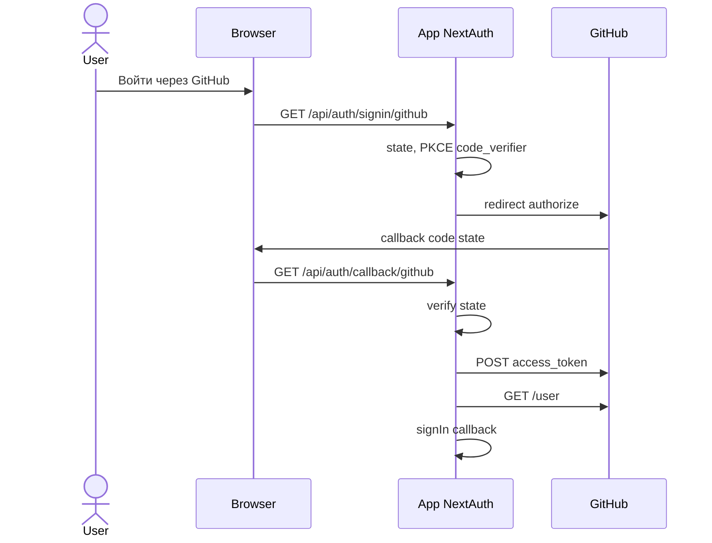
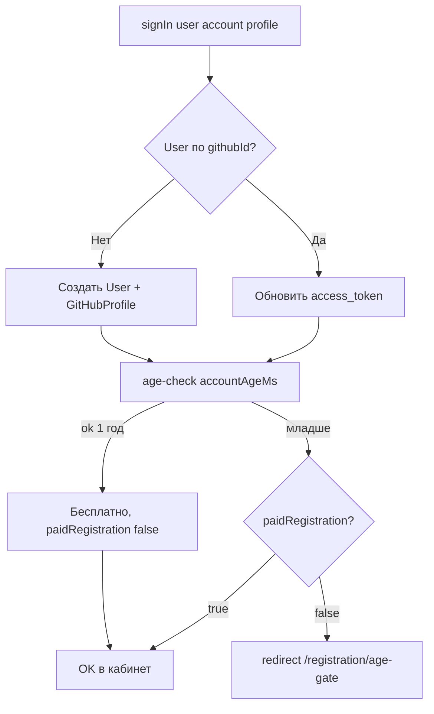

# Introduction

Данная спецификация описывает механизм аутентификации через GitHub OAuth, логику проверки возраста аккаунта (age-check) и путь платной регистрации для аккаунтов моложе 1 года.

## 1. Purpose & Scope

**Назначение**: определить полный флоу регистрации и аутентификации пользователей Referi.

**Аудитория**: инженеры, AI-агенты, QA.

**Допущения**:
- Auth.js v5 (NextAuth) используется как OAuth-провайдер.
- GitHub OAuth App зарегистрировано в настройках GitHub организации/пользователя.
- Дополнительный API-вызов `GET /user` выполняется **на сервере** в колбэке `signIn` или `jwt` Auth.js.

---

## 2. Definitions

| Термин                   | Определение                                                             |
| ------------------------ | ----------------------------------------------------------------------- |
| **GitHub OAuth**         | Протокол авторизации через GitHub; сервер получает `access_token`       |
| **age-check**            | Проверка даты создания GitHub аккаунта: `now() - created_at < 365 дней` |
| **Молодой аккаунт**      | GitHub аккаунт с возрастом < 365 дней на момент регистрации             |
| **Регистрационный сбор** | Единоразовый платёж для молодых аккаунтов; сумма фиксирована в `BUSINESS_RULES.REGISTRATION_FEE_KOP` (50 000 ₽) |
| **paidRegistration**     | Флаг в `GitHubProfile`; `true` если молодой аккаунт оплатил сбор        |

---

## 3. Requirements, Constraints & Guidelines

- **REQ-001**: Единственный способ входа/регистрации — через GitHub OAuth. Пароли не поддерживаются.
- **REQ-002**: При каждом входе (не только первом) проверяется, завершена ли регистрация (age-check пройден или `paidRegistration = true`).
- **REQ-003**: Вызов `GET /user` GitHub REST API выполняется только на сервере (в Auth.js callback), никогда в браузере.
- **REQ-004**: `access_token` GitHub сохраняется в БД в зашифрованном виде (AES-256, ключ в `GITHUB_TOKEN_ENCRYPTION_KEY` env).
- **REQ-005**: После оплаты регистрационного сбора поле `GitHubProfile.paidRegistration` устанавливается в `true` через webhook ЮКассы.
- **REQ-006**: Повторная оплата регистрационного сбора тем же GitHub-аккаунтом невозможна (идемпотентность).
- **CON-001**: Регистрационный сбор не возвращается ни при каких обстоятельствах.
- **SEC-001**: `access_token` не передаётся клиенту и не логируется.
- **SEC-002**: Callback State параметр OAuth верифицируется (CSRF protection — встроено в Auth.js).
- **GUD-001**: При ошибке age-check пользователь редиректится на `/registration/age-gate`, а не получает 500.

---

## 4. Interfaces & Data Contracts

### 4.1 Полный флоу регистрации

**Шаги 1–2: OAuth (браузер + GitHub)**



**Шаг 3: `signIn` callback (серверный)**



### 4.2 Страница `/registration/age-gate`

**URL**: `/registration/age-gate`

**Содержимое**:
- Объяснение почему аккаунт не прошёл проверку.
- Информация о размере сбора (50 000 ₽, значение из `BUSINESS_RULES.REGISTRATION_FEE_KOP`).
- Кнопка «Оплатить и зарегистрироваться» → вызывает `auth.initiateRegistrationPayment` mutation с `{ userId }` (процедура **public** в [`src/server/trpc/routers/auth.ts`](../src/server/trpc/routers/auth.ts); вызывать только из доверенного UI после установления сессии).
- После успешного платежа (webhook) → автоматический редирект в личный кабинет.

**Логика кнопки**:
```typescript
// Клиент
const pay = trpc.auth.initiateRegistrationPayment.useMutation();
void pay.mutateAsync({ userId: sessionUser.id });

// Сервер: src/server/trpc/routers/auth.ts
initiateRegistrationPayment: publicProcedure
  .input(z.object({ userId: z.string().uuid() }))
  .mutation(async ({ ctx, input }) => {
    const profile = await ctx.db.gitHubProfile.findUnique({
      where: { userId: input.userId },
    });
    if (!profile) throw new TRPCError({ code: "NOT_FOUND" });
    if (profile.paidRegistration) {
      throw new TRPCError({ code: "PRECONDITION_FAILED", message: "ALREADY_PAID" });
    }
    const feeKopecks = BUSINESS_RULES.REGISTRATION_FEE_KOP;
    const payment = await paymentProvider.createPayment({
      /* … amountKopecks: feeKopecks, metadata: { userId, type: "registration" } … */
    });
    await ctx.db.registrationPayment.create({
      data: {
        userId: input.userId,
        amountKopecks: feeKopecks,
        yookassaPaymentId: payment.paymentId,
      },
    });
    return { confirmationUrl: payment.confirmationUrl };
  }),
```

### 4.3 Обработка успешного платежа за регистрацию

```typescript
// src/server/workers/paymentWorker.ts (фрагмент обработчика webhook)

case 'payment.succeeded':
  const regPayment = await db.registrationPayment.findUnique({
    where: { yookassaPaymentId: event.object.id },
  });
  if (regPayment && !regPayment.paidAt) {
    await db.$transaction([
      db.registrationPayment.update({
        where: { id: regPayment.id },
        data: { paidAt: new Date() },
      }),
      db.gitHubProfile.update({
        where: { userId: regPayment.userId },
        data: { paidRegistration: true },
      }),
    ]);
    // Уведомить пользователя (email/Telegram)
    await emailService.send(regPayment.userId, 'registration_complete');
  }
```

### 4.4 Auth.js конфигурация

```typescript
// src/lib/auth.ts

import NextAuth from 'next-auth';
import GitHub from 'next-auth/providers/github';

export const { handlers, signIn, signOut, auth } = NextAuth({
  providers: [
    GitHub({
      clientId: process.env.GITHUB_ID!,
      clientSecret: process.env.GITHUB_SECRET!,
      authorization: {
        params: { scope: 'read:user user:email' },
      },
    }),
  ],

  callbacks: {
    async signIn({ user, account, profile }) {
      if (account?.provider !== 'github') return false;

      const githubProfile = profile as GitHubProfile;
      const githubId = githubProfile.id;
      const githubCreatedAt = new Date(githubProfile.created_at);

      // Upsert User и GitHubProfile
      await upsertUserFromGitHub({
        githubId,
        githubLogin: githubProfile.login,
        githubCreatedAt,
        accessToken: encryptToken(account.access_token!),
      });

      // age-check
      const ageMs = Date.now() - githubCreatedAt.getTime();
      const isOldEnough = ageMs >= BUSINESS_RULES.GITHUB_ACCOUNT_MIN_AGE_DAYS * 86400_000;

      if (!isOldEnough) {
        const dbProfile = await db.gitHubProfile.findUnique({
          where: { githubId },
        });
        if (!dbProfile?.paidRegistration) {
          return '/registration/age-gate';
        }
      }

      return true;
    },

    async session({ session, token }) {
      if (token.sub) {
        session.user.id = token.sub;
        session.user.roles = token.roles as UserRole[];
      }
      return session;
    },

    async jwt({ token, user }) {
      if (user) {
        const dbUser = await db.user.findUnique({
          where: { id: user.id },
          select: { roles: true },
        });
        token.roles = dbUser?.roles ?? [];
      }
      return token;
    },
  },

  pages: {
    signIn: '/login',
    error: '/login/error',
  },
});
```

### 4.5 Переменные окружения

| Переменная                    | Обязательна | Описание                                            |
| ----------------------------- | ----------- | --------------------------------------------------- |
| `GITHUB_ID`                   | Да          | Client ID GitHub OAuth App                          |
| `GITHUB_SECRET`               | Да          | Client Secret GitHub OAuth App                      |
| `GITHUB_TOKEN_ENCRYPTION_KEY` | Да          | 32-байтный ключ AES-256 для шифрования access_token |
| `NEXTAUTH_SECRET`             | Да          | Секрет для подписи JWT сессий Auth.js               |
| `NEXTAUTH_URL`                | Да          | Базовый URL приложения (для OAuth callback)         |

---

## 5. Acceptance Criteria

- **AC-001**: Given GitHub аккаунт создан < 365 дней назад и `paidRegistration = false`, When пользователь проходит OAuth, Then Auth.js возвращает редирект на `/registration/age-gate`.
- **AC-002**: Given GitHub аккаунт создан < 365 дней назад и `paidRegistration = true`, When пользователь проходит OAuth, Then вход выполняется успешно.
- **AC-003**: Given GitHub аккаунт создан ≥ 365 дней назад, When пользователь проходит OAuth, Then вход выполняется успешно без оплаты.
- **AC-004**: Given `auth.initiateRegistrationPayment` с одним и тем же `userId` до оплаты, When повторный вызов, Then поведение согласовано с реализацией (новый `RegistrationPayment` / провайдер; идемпотентность на стороне ЮKassa по ключам).
- **AC-005**: Given webhook `payment.succeeded` для регистрационного платежа, When обработчик выполняется, Then `GitHubProfile.paidRegistration = true` и `RegistrationPayment.paidAt` установлен.
- **AC-006**: Given `access_token` GitHub сохранён в БД, When значение читается из БД напрямую через SQL, Then оно зашифровано (не является читаемым токеном).
- **AC-007**: Given пользователь с `paidRegistration = true` вызывает `auth.initiateRegistrationPayment` с его `userId`, When запрос приходит, Then `PRECONDITION_FAILED` / `ALREADY_PAID`.

---

## 6. Test Automation Strategy

- **Unit-тесты**: `upsertUserFromGitHub` с мок-БД; `encryptToken`/`decryptToken` round-trip.
- **Integration-тесты**: мок GitHub OAuth сервер (MSW); проверка age-check с разными датами создания.
- **E2E-тест** (Playwright): полный OAuth flow через GitHub в staging среде с тестовым аккаунтом.

---

## 7. Rationale & Context

**Только GitHub**: разработчики в РФ активно используют GitHub. Аккаунт GitHub — надёжный прокси-сигнал реальности разработчика (история коммитов, публичные репозитории). Это снижает порог входа для верификации без сложной KYC-процедуры.

**Возрастной сбор**: 365 дней — стандартный период для органического развития аккаунта. Фиксированная сумма 50 000 ₽ создаёт экономический барьер для массового создания фейков, при этом не являясь запретительной для серьёзных пользователей.

**Шифрование access_token**: GitHub access token с `read:user` скоупом — sensitive data. Хранение в открытом виде нарушало бы принципы безопасности.

---

## 8. Dependencies & External Integrations

- **EXT-001**: GitHub REST API v3 — endpoint `GET https://api.github.com/user`, поле `created_at`.
- **PLT-002**: Auth.js v5 — callback `signIn` поддерживает возврат строки-URL для редиректа.
- **SVC-001**: ЮКасса Payments API — оплата регистрационного сбора.

---

## 9. Examples & Edge Cases

### Edge Case: пользователь удалил GitHub аккаунт и создал новый

```
Новый аккаунт не имеет записи в GitHubProfile → создаётся новый User
Дата создания нового аккаунта < 365 дней → требуется сбор
Предыдущий User (со старым githubId) остаётся в БД, но без входа
```

### Edge Case: GitHub API недоступен во время signIn

```
GET api.github.com/user → timeout / 5xx
Auth.js signIn callback должен вернуть false (deny login) + логировать ошибку
Пользователю показывается '/login/error'
Не создаётся неполный User без GitHubProfile
```

---

## 10. Validation Criteria

1. `src/lib/auth.ts` содержит `signIn` callback с age-check логикой.
2. `GITHUB_TOKEN_ENCRYPTION_KEY` используется во всех операциях записи/чтения `accessToken`.
3. `GET api.github.com/user` вызывается только в серверных контекстах (нет клиентских fetch).
4. Тест `AC-001` проходит на мок-данных с `created_at = 1 месяц назад`.
5. Тест `AC-003` проходит на мок-данных с `created_at = 2 года назад`.

---

## 11. Related Specifications

- [spec-schema-database.md](spec-schema-database.md) — `GitHubProfile`, `RegistrationPayment`
- [spec-data-payments-escrow.md](spec-data-payments-escrow.md) — платёж регистрационного сбора
- [spec-design-api.md](spec-design-api.md) — `auth.initiateRegistrationPayment` mutation
