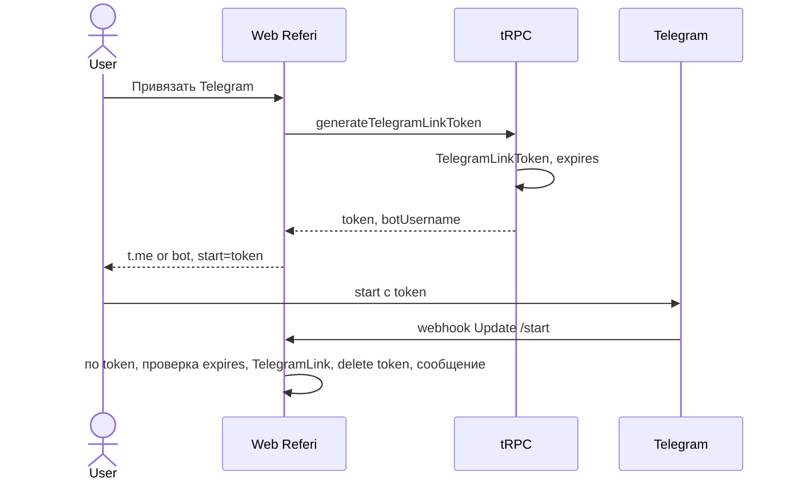

# Introduction

Данная спецификация описывает интеграцию Telegram-бота в систему Referi. Бот выполняет две функции: (1) канал для жалоб пользователей и общения с модераторами; (2) уведомления модераторам о новых спорах и событиях, требующих ручного вмешательства. Бот создаётся владельцем сервиса через @BotFather вне рамок этой спецификации.

## 1. Purpose & Scope

**Назначение**: определить контракты взаимодействия сервиса с Telegram Bot API, формат уведомлений, команды бота и механизм верификации webhook.

**Аудитория**: инженеры, AI-агенты, QA.

**Допущения**:
- Telegram-бот создан через @BotFather; `TELEGRAM_BOT_TOKEN` доступен как переменная окружения.
- Webhook режим (не polling): Telegram посылает обновления на `POST /api/webhooks/telegram`.
- Модераторы общаются с ботом напрямую в Telegram; сервис отправляет им уведомления.
- Пользователи привязывают Telegram через команду `/link` в боте (опционально).
- Уведомления пользователям через Telegram отправляются только если `TelegramLink` существует.

---

## 2. Definitions

| Термин              | Определение                                                       |
| ------------------- | ----------------------------------------------------------------- |
| **Bot Token**       | Секретный токен бота, полученный от @BotFather                    |
| **Chat ID**         | Уникальный идентификатор чата в Telegram (личного или группового) |
| **Webhook Secret**  | Строка для верификации входящих webhook-запросов от Telegram      |
| **Update**          | Объект обновления от Telegram (сообщение, callback_query и т.д.)  |
| **Inline Keyboard** | Набор кнопок в сообщении Telegram (callback buttons)              |
| **TelegramLink**    | Запись в БД, связывающая `userId` Referi с `telegramUserId`       |

---

## 3. Requirements, Constraints & Guidelines

- **REQ-001**: Webhook URL регистрируется при старте приложения через `setWebhook` Telegram API с `secret_token`.
- **REQ-002**: Каждый входящий webhook верифицируется по заголовку `X-Telegram-Bot-Api-Secret-Token`.
- **REQ-003**: Обработка входящих Updates помещается в BullMQ очередь; webhook отвечает 200 OK немедленно.
- **REQ-004**: Все исходящие сообщения используют `parse_mode: 'HTML'`; markdown не используется (несовместимость экранирования).
- **REQ-005**: `telegramService.sendMessage` не бросает исключение при ошибке отправки — логирует и продолжает (уведомления некритичны для бизнес-логики).
- **REQ-006**: Привязка Telegram к аккаунту Referi (`/link`) использует одноразовый токен, валидный 10 минут.
- **SEC-001**: `TELEGRAM_BOT_TOKEN` никогда не передаётся клиенту и не логируется.
- **SEC-002**: `TELEGRAM_WEBHOOK_SECRET` — случайная строка ≥ 32 символов.
- **GUD-001**: Все тексты уведомлений хранятся в `shared/telegram/messages.ts` (не захардкожены в сервисе).

---

## 4. Interfaces & Data Contracts

### 4.1 Переменные окружения

| Переменная                   | Обязательна | Описание                                |
| ---------------------------- | ----------- | --------------------------------------- |
| `TELEGRAM_BOT_TOKEN`         | Да          | Токен бота от @BotFather                |
| `TELEGRAM_WEBHOOK_SECRET`    | Да          | Секрет для верификации входящих webhook |
| `TELEGRAM_MODERATOR_CHAT_ID` | Да          | Chat ID группы/канала модераторов       |

### 4.2 Интерфейс TelegramService

```typescript
// src/server/services/telegramService.ts

export interface SendMessageOptions {
  chatId: number | string;
  text: string;                        // HTML-разметка
  replyMarkup?: InlineKeyboardMarkup;  // Кнопки (опционально)
  parseMode?: 'HTML';
}

export interface TelegramService {
  /**
   * Отправить сообщение в указанный чат.
   * Не бросает исключение при ошибке; логирует.
   */
  sendMessage(options: SendMessageOptions): Promise<void>;

  /**
   * Ответить на callback_query (кнопку).
   */
  answerCallbackQuery(callbackQueryId: string, text?: string): Promise<void>;

  /**
   * Установить webhook при старте приложения.
   */
  setWebhook(url: string, secretToken: string): Promise<void>;
}
```

### 4.3 Команды бота

| Команда                      | Кто использует      | Описание                               |
| ---------------------------- | ------------------- | -------------------------------------- |
| `/start`                     | Любой               | Приветственное сообщение с инструкцией |
| `/link <token>`              | Пользователь Referi | Привязать Telegram к аккаунту Referi   |
| `/status`                    | Пользователь Referi | Посмотреть статус активных заявок      |
| `/help`                      | Любой               | Список доступных команд                |
| `/dispute <caseId>`          | Модератор           | Открыть детали спора                   |
| `/resolve_referrer <caseId>` | Модератор           | Решить спор в пользу реферальщика      |
| `/resolve_seeker <caseId>`   | Модератор           | Решить спор в пользу соискателя        |

### 4.4 Флоу привязки Telegram аккаунта (`/link`)



### 4.5 Обработка входящих Updates (webhook handler)

```typescript
// app/api/webhooks/telegram/route.ts

export async function POST(request: Request) {
  // 1. Верификация
  const secret = request.headers.get('X-Telegram-Bot-Api-Secret-Token');
  if (secret !== process.env.TELEGRAM_WEBHOOK_SECRET) {
    return new Response('Unauthorized', { status: 401 });
  }

  // 2. Немедленно ответить 200 (Telegram требует ответ в течение 5 сек)
  const update = await request.json() as TelegramUpdate;

  // 3. Поставить в очередь (non-blocking)
  await telegramUpdateQueue.add('handle-update', { update }, {
    jobId: `tg-update:${update.update_id}`,
    attempts: 3,
  });

  return new Response('OK', { status: 200 });
}
```

### 4.6 Уведомления — полный перечень событий

| Событие                    | Получатель  | Шаблон сообщения              |
| -------------------------- | ----------- | ----------------------------- |
| Новый отклик на вакансию   | Реферальщик | `messages.newApplication`     |
| Оплата соискателя получена | Реферальщик | `messages.paymentReceived`    |
| Новый спор открыт          | Модераторы  | `messages.newDispute`         |
| Жалоба подана              | Модераторы  | `messages.newAbuseReport`     |
| Вакансия заморожена        | Реферальщик | `messages.vacancyFrozen`      |
| Бан реферальщика           | Реферальщик | `messages.referrerBanned`     |
| Деньги возвращены          | Соискатель  | `messages.refundIssued`       |
| Оффер принят (выплата)     | Реферальщик | `messages.payoutInitiated`    |
| Попытка регенерирована     | Реферальщик | `messages.attemptRegenerated` |
| Запрос отмены соискателя   | Реферальщик | `messages.cancelRequested`    |

### 4.7 Пример шаблонов сообщений

```typescript
// shared/telegram/messages.ts

export const messages = {
  newApplication: (data: { vacancyTitle: string; appId: string }) =>
    `<b>Новый отклик</b> на вакансию <i>${data.vacancyTitle}</i>\n` +
    `Перейдите в личный кабинет, чтобы просмотреть кандидата.`,

  newDispute: (data: { caseId: string; appId: string; referrerName: string }) =>
    `<b>⚠️ Новый спор #${data.caseId}</b>\n` +
    `Заявка: <code>${data.appId}</code>\n` +
    `Реферальщик: ${data.referrerName}\n\n` +
    `Команды:\n/dispute ${data.caseId}\n` +
    `/resolve_referrer ${data.caseId}\n` +
    `/resolve_seeker ${data.caseId}`,

  vacancyFrozen: (data: { vacancyTitle: string; frozenUntil: string }) =>
    `<b>🔒 Вакансия заморожена</b>\n` +
    `"${data.vacancyTitle}"\n` +
    `Причина: нет реакции на отклики в течение 7 дней.\n` +
    `Разморозка: ${data.frozenUntil}`,

  refundIssued: (data: { amountRub: string; reason: string }) =>
    `<b>💰 Возврат средств</b>\n` +
    `Сумма: ${data.amountRub} ₽\n` +
    `Причина: ${data.reason}\n` +
    `Средства поступят на карту в течение 10 рабочих дней.`,
};
```

### 4.8 Уведомления модераторам — группа

Все уведомления о спорах и жалобах отправляются в `TELEGRAM_MODERATOR_CHAT_ID`. Это может быть личный чат модератора или Telegram-группа с несколькими модераторами.

```typescript
// src/server/services/telegramService.ts (фрагмент)

async function notifyModerators(text: string, replyMarkup?: InlineKeyboardMarkup) {
  await sendMessage({
    chatId: process.env.TELEGRAM_MODERATOR_CHAT_ID!,
    text,
    replyMarkup,
  });
}
```

### 4.9 Регистрация webhook при старте

```typescript
// app/startup.ts или в Next.js instrumentation.ts

export async function register() {
  if (process.env.NEXT_RUNTIME === 'nodejs') {
    const webhookUrl = `${process.env.NEXT_PUBLIC_URL}/api/webhooks/telegram`;
    await telegramService.setWebhook(webhookUrl, process.env.TELEGRAM_WEBHOOK_SECRET!);
  }
}
```

---

## 5. Acceptance Criteria

- **AC-001**: Given webhook без `X-Telegram-Bot-Api-Secret-Token`, When запрос получен, Then возвращается 401 и Update не обрабатывается.
- **AC-002**: Given пользователь отправил `/link {validToken}` в бот, When webhook обработан, Then создаётся `TelegramLink` и пользователь получает подтверждение.
- **AC-003**: Given пользователь отправил `/link {expiredToken}`, When webhook обработан, Then бот отвечает «Токен истёк, запросите новый на сайте».
- **AC-004**: Given спор открыт (`DISPUTED`), When `notifyModerators` вызван, Then сообщение отправлено в `TELEGRAM_MODERATOR_CHAT_ID` с `caseId` и командами.
- **AC-005**: Given `telegramService.sendMessage` выбрасывает ошибку сети, When вызов происходит, Then исключение не пробрасывается выше; ошибка только логируется.
- **AC-006**: Given тот же `update_id` получен дважды (дублирующий webhook), When оба попадают в очередь, Then только один BullMQ job создаётся (уникальный `jobId`).
- **AC-007**: Given `setWebhook` вызван при старте, When Telegram API возвращает успех, Then webhook URL зарегистрирован с `secret_token`.

---

## 6. Test Automation Strategy

- **Unit-тесты**: `TelegramService` мокируется; тесты на формирование HTML-текстов уведомлений.
- **Webhook-тесты**: POST на `/api/webhooks/telegram` с корректным и некорректным секретом.
- **Link-flow тест**: генерация токена → симуляция `/start {token}` → проверка `TelegramLink` в БД.
- **Integration**: мок Telegram Bot API (MSW) для проверки отправки сообщений без реальных запросов.

---

## 7. Rationale & Context

**Webhook, не polling**: Polling требует постоянного запущенного процесса. Webhook работает нативно с serverless/Next.js деплоем.

**Немедленный 200 OK + очередь**: Telegram ожидает ответ в течение 5 секунд. Медленная обработка (БД, внешние API) может привести к повторным отправкам. Очередь BullMQ с уникальным `jobId` гарантирует идемпотентность.

**HTML вместо Markdown**: MarkdownV2 требует экранирования множества символов (`.`, `-`, `_` и т.д.), что усложняет генерацию динамических сообщений. HTML-разметка проще и надёжнее.

**Уведомления опциональны**: привязка Telegram необязательна. Основные уведомления идут через email; Telegram — дополнительный канал.

---

## 8. Dependencies & External Integrations

- **SVC-003**: Telegram Bot API (https://api.telegram.org) — отправка сообщений, регистрация webhook.
- **INF-002**: Redis + BullMQ — очередь обработки входящих Updates.

---

## 9. Examples & Edge Cases

### Edge Case: недоступность Telegram API в РФ

```typescript
// src/server/services/telegramService.ts

async sendMessage(options: SendMessageOptions): Promise<void> {
  try {
    await fetch(`https://api.telegram.org/bot${TOKEN}/sendMessage`, {
      method: 'POST',
      headers: { 'Content-Type': 'application/json' },
      body: JSON.stringify({
        chat_id: options.chatId,
        text: options.text,
        parse_mode: 'HTML',
        reply_markup: options.replyMarkup,
      }),
      // Если Telegram заблокирован → используем прокси через env TELEGRAM_API_PROXY
      // dispatcher: проксируем через HTTPS-прокси если TELEGRAM_PROXY_URL задан
    });
  } catch (err) {
    logger.error('Telegram sendMessage failed', { chatId: options.chatId, err });
    // Не бросаем ошибку — уведомления некритичны
  }
}
```

Рекомендация при блокировке: использовать HTTPS-прокси или MTProxy; настраивается через `TELEGRAM_API_PROXY_URL` env.

### Edge Case: модератор нажал кнопку в боте (Inline Keyboard)

```
// Модератор разрешает спор текстовыми командами /resolve_referrer, /resolve_seeker (caseId берётся из уведомления).
// Inline Keyboard в уведомлении не используется.
//
// Update { callback_query: { data: 'resolve:referrer:{caseId}', from: {...} } }
// → при необходимости можно обработать callback отдельно
```

---

## 10. Validation Criteria

1. `TELEGRAM_BOT_TOKEN` и `TELEGRAM_WEBHOOK_SECRET` не появляются в клиентском коде и лог-выводе.
2. `POST /api/webhooks/telegram` без секрета возвращает 401.
3. Все тексты уведомлений находятся в `shared/telegram/messages.ts`.
4. `telegramService.sendMessage` не выбрасывает исключение при ошибке сети (тест).
5. При старте приложения вызывается `setWebhook` с корректным URL.

---

## 11. Related Specifications

- [spec-design-api.md](spec-design-api.md) — `/api/webhooks/telegram` роут
- [spec-process-application-lifecycle.md](spec-process-application-lifecycle.md) — события, генерирующие уведомления
- [spec-process-referrer-sla.md](spec-process-referrer-sla.md) — санкции, генерирующие уведомления
- [spec-schema-database.md](spec-schema-database.md) — `TelegramLink`
